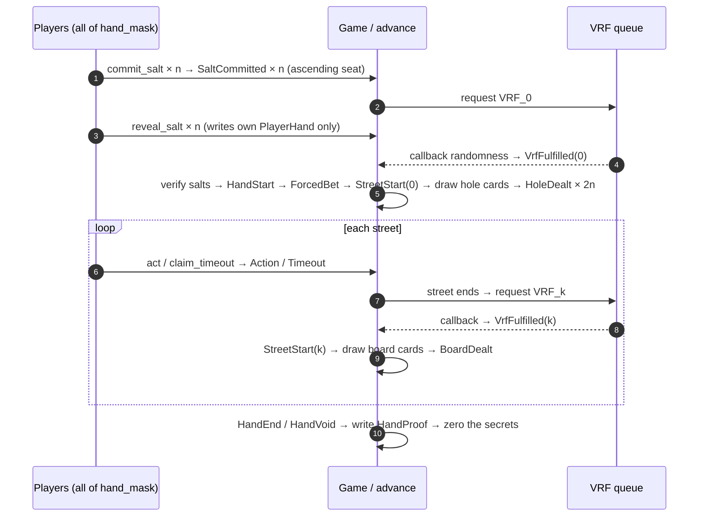

# solpoker Dealing Protocol: Byte-Level Specification v1 (Stage 4, Final)

> **Status**: final v1. This document supersedes the design-level description in [stage1-design.md](design/stage1-design.md) §8; wherever §8 disagrees with this document, this document wins.
> **Companion deliverables**: the on-chain Rust implementation `crates/solpoker-core`, the Python reference implementation `reference/solpoker_deal.py`, and the test vectors `vectors/v1/*.json`. CI asserts byte-for-byte agreement of all three (§9.3).
> **Scope**: this document specifies only byte encodings, formulas, and the verification procedure, so that a third party can independently recompute and verify any hand. The on-chain PlayerHand accounts and dealing-related instructions (`commit_salt`, `reveal_salt`, and the account structure of `advance`) land with the nine-seat model in Stage 5/6 and are out of scope here.

---

## 1. Scope and Versioning

**Version**: v1. Every `/v1` domain-separation string and every byte layout in this document is immutable once published; any change starts a new v2 document, and historical hands are always verified against v1.

**Covered**: salt commit/reveal, the seed hierarchy, canonical event encoding, the draw algorithm, the verification procedure, test vectors, and security properties.

**Not covered**: account lists and permission checks of on-chain instructions (Stage 5/6), CPI details of VRF request/callback (design doc §9), betting rules and the settlement/rake algorithm (design doc §7 — the verification procedure only references its results).

### 1.1 Changes from Design-Level §8 to Byte-Level v1

| # | Change | Design-level §8 | Byte-level v1 |
|---|---|---|---|
| C1 | Seat count | 2 players, fields `[T; 2]` | 9 fixed physical seats (D7); participants per hand given by `hand_mask` (u16), 2–9 players; arrays are always `[T; 9]` |
| C2 | Salt aggregation | `seed_k = sha256(VRF_k ‖ salt_0 ‖ salt_1)` | Introduces `salt_digest`, explicitly binding table, hand_id, hand_mask and each seat's `(seat, occupancy_id, occupant, salt)` (§5.1) |
| C3 | Seed formula | `sha256(VRF_k ‖ salt_0 ‖ salt_1)` | `seed_k = sha256("solpoker/seed/v1" ‖ VRF_k ‖ salt_digest)` (§5.2) |
| C4 | First-hand button | `HMAC(...)[0] & 1` | Read the first 8 HMAC bytes big-endian as u64, reduce mod `popcount(hand_mask)`, map to the n-th set bit (§5.3); with 2 players this is equivalent to the original formula (mod 2 is the low bit; see the equivalence note in §5.3) |
| C5 | Hole-dealing start | "starting from SB" | Uniformly "the seat clockwise after the button" (`next_clockwise`), one rule for 2–9 players; heads-up the button is SB, so the first card goes to the BB (§7.3) |
| C6 | Runout | Prose description | Finalized: `RunoutStarted` event + a single VRF_r; cards dealt in runout carry `street` = actual position (1/2/3), `vrf_src = 4`; `draw_no` follows canonical per-position numbering and continues seamlessly (§7.4) |
| C7 | Event table | Field-name list | Full byte-level layouts for all events (§6.2); `StreetSkipped` semantics added |
| C8 | transcript_0 | Formula existed | Pins `program_id` as part of the domain (§6.1) |
| C9 | HandStart position | Unspecified | Normalized as the **first event of the stream**; its contents (notably the first hand's button) are computed once VRF_0 and all salts are available — log order is canonical, not causal (§6.3) |

---

## 2. Notation and Encoding Conventions

| Convention | Meaning |
|---|---|
| `a ‖ b` | Byte-string concatenation |
| Integer encoding | **All integers are big-endian**, width per the field tables; consistent with "read the first 8 hash bytes big-endian as u64" |
| String constants | UTF-8 encoded, **no trailing NUL**; a quoted string in this document means its literal bytes |
| `sha256` | SHA-256, 32-byte output |
| `HMAC-SHA256(key, msg)` | RFC 2104; 32-byte output; `out[i..j]` denotes the byte range (inclusive of i, exclusive of j) |
| `BE_u64(b)` | Interpret 8 bytes big-endian as u64 |
| Hex display | Byte strings in this document and in the test vectors are lowercase hex with no `0x` prefix; account addresses in prose are base58 |
| `table` | Table account address, 32 bytes |
| `program_id` | solpoker program address, 32 bytes |
| `hand_id` | u64, incremented per hand, encoded as 8 big-endian bytes |
| `player_i` / `occupant_i` | Wallet public key of seat i's occupant, 32 bytes (even when an action is signed by a session key, the wallet address is used here) |
| `seat` | Physical seat number, u8, values 0–8 |
| `hand_mask` | u16; bit i set means seat i participates in this hand; must satisfy 2 ≤ popcount ≤ 9 |

`next_clockwise(from, mask)`: starting from `from`, find the next set seat strictly clockwise (seat numbers increasing, wrapping from 8 to 0); `from` itself is not eligible. Reference implementation: `crates/solpoker-core/src/seats.rs`.

`nth_set_bit(mask, n)`: the seat number of the n-th (0-based) set bit of `mask` in ascending seat order.

---

## 3. Card and Deck Encoding

One card is one byte:

```text
card = rank × 4 + suit
```

| rank | 2 | 3 | 4 | 5 | 6 | 7 | 8 | 9 | T | J | Q | K | A |
|---|---|---|---|---|---|---|---|---|---|---|---|---|---|
| code | 0 | 1 | 2 | 3 | 4 | 5 | 6 | 7 | 8 | 9 | 10 | 11 | 12 |

| suit | ♣ | ♦ | ♥ | ♠ |
|---|---|---|---|---|
| code | 0 | 1 | 2 | 3 |

- Valid card values are 0–51; `0xFF` is reserved as the "no card" marker (account storage only; it never enters the event stream or any computation).
- The **deck** is an ordered list, initially `[0, 1, …, 51]` (ascending card value). Each drawn card is removed from the list; there is no whole-deck shuffle.
- Let `n` denote the number of cards remaining in the deck. Before the first draw of a hand, `n = 52`.

---

## 4. Salt Commitment and Reveal

### 4.1 Formulas

```text
salt_i = 32 bytes, regenerated per hand by the client or agent SDK using a CSPRNG
C_i    = sha256("solpoker/salt/v1" ‖ table ‖ hand_id ‖ player_i ‖ salt_i)
```

### 4.2 Protocol-Level Rules

1. The participants of a hand are exactly the seats in `hand_mask`; **only `hand_mask` members commit**.
2. `commit_salt(hand_id, C_i)` publicly writes the commitment into `Game.seats[i]`; a commitment for the next hand may be pre-submitted while the current hand is still being played.
3. **VRF_0 is requested only after every `hand_mask` member has committed**; the VRF_0 request and salt reveals proceed in parallel.
4. `reveal_salt(hand_id, salt_i)` writes only the player's own PlayerHand (D6) and does not reference Game.
5. The dealing `advance` reads the salts from the PlayerHands and verifies `sha256(…) == C_i` for each seat.
6. **If any salt is missing, the whole hand is void** (`HandVoid{reason = 0}`); all contributions are refunded in full and each missing party is charged one timeout. A failed commitment check counts as a missing salt.
7. Once all commitments are in and before VRF_0 arrives, no party can influence the seed: the VRF output does not exist yet at request time, and the salts are locked by their commitments.
8. Salts are aggregated in **ascending seat order** (§5.1) — not by position (BTN/SB/BB), not by commitment time. Salts are committed once per hand and reused across streets.

---

## 5. Seed Hierarchy

### 5.1 Salt Digest

```text
entry_i     = seat(u8) ‖ occupancy_id(u64) ‖ occupant(32) ‖ salt_i(32)   // 73 bytes
salt_digest = sha256("solpoker/salts/v1" ‖ table ‖ hand_id ‖ hand_mask(u16)
                     ‖ entry_0 ‖ entry_1 ‖ … ‖ entry_{m-1})
```

- `entry_i` are ordered by **ascending seat**, covering all m = popcount seats of `hand_mask`.
- `occupancy_id` is the seat's `SeatState.occupancy_id` at hand start, identical to the value in the `HandStart` event. Even if the same wallet re-sits after a seat change, the occupancy_id differs and so does the digest.
- `salt_digest` is computed once per hand and reused across streets.

### 5.2 Per-Street Seeds

```text
seed_k = sha256("solpoker/seed/v1" ‖ VRF_k ‖ salt_digest)
```

| k | Street | VRF source | Used for |
|---|---|---|---|
| 0 | Preflop | VRF_0 | Hole cards; button pick for the first hand of a new seating combination |
| 1 | Flop | VRF_1 | 3 board cards |
| 2 | Turn | VRF_2 | 1 board card |
| 3 | River | VRF_3 | 1 board card |
| 4 | Runout | VRF_r | All remaining board cards after an all-in merge |

`VRF_k` is the 32-byte randomness of the callback actually used for that street (on retry, the one matching the attempt recorded in the `VrfFulfilled` event; ignored late callbacks never enter the computation).

### 5.3 First-Hand Button and Rotation

**First hand of a new combination** (any seat's `(occupant, occupancy_id)` differs from the previous hand):

```text
raw    = HMAC-SHA256(key = seed_0, msg = "solpoker-v1/button" ‖ table ‖ hand_id)
v      = BE_u64(raw[0..8])
button = nth_set_bit(hand_mask, v mod popcount(hand_mask))
```

- Modulo bias: popcount ≤ 9, so the discarded relative probability mass is < 9 / 2^64, negligible; unlike card draws there is no rejection sampling here (only one value is chosen, and the bias bound is provable). This rule is pinned for determinism — do not "helpfully" upgrade it to rejection sampling.
- With 2 players, `v mod 2` is the low bit of `v`, i.e. the generalization of the design-level formula `raw[0] & 1`.

**Every subsequent hand**:

```text
button_h = next_clockwise(button_{h-1}, hand_mask_h)
```

`button_{h-1}` is simply the previous hand's seat number, whether or not that seat is occupied in the new hand; empty seats left by departures are skipped by `next_clockwise`.

---

## 6. Event Stream and Canonical Encoding

### 6.1 Chain Hash

```text
transcript_0     = sha256("solpoker/transcript/v1" ‖ program_id ‖ table ‖ hand_id)
transcript_{n+1} = sha256(transcript_n ‖ encode(event_n))
```

`encode(event)` = `tag(u8) ‖ fixed-width fields (all big-endian)`. All events are fixed-length: no length prefixes, no separators.

`Game.events` holds the complete event list of the current hand (public, capped at ~128 entries); since Game is committed at settlement, events persist in L1 commit history, and the indexer keeps a copy. `HandProof` stores only `transcript_final`.

### 6.2 Event Summary Table

| tag | Event | Fields (in encoding order) | Total length |
|---|---|---|---|
| 0x01 | HandStart | hand_id u64, button u8, hand_mask u16, stack[9] u64, occupancy_id[9] u64 | 156 |
| 0x02 | SaltCommitted | seat u8, C_i 32 | 34 |
| 0x03 | VrfFulfilled | target u8, attempt u8 | 3 |
| 0x04 | ForcedBet | seat u8, kind u8, amount u64 | 11 |
| 0x05 | HoleDealt | seat u8, draw_no u16 | 4 |
| 0x06 | StreetStart | street u8 | 2 |
| 0x07 | Action | seat u8, kind u8, amount u64 | 11 |
| 0x08 | Timeout | seat u8, auto_kind u8 | 3 |
| 0x09 | BoardDealt | street u8, card u8, draw_no u16, vrf_src u8 | 6 |
| 0x0A | RunoutStarted | — (tag only) | 1 |
| 0x0B | StreetSkipped | street u8 | 2 |
| 0x0C | HandEnd | result u8, deltas[9] i64, rake u64 | 82 |
| 0x0D | HandVoid | reason u8 | 2 |

### 6.3 Per-Event Layouts and Semantics

Byte offsets start after the tag (offset 0, 1 byte).

**0x01 HandStart (156 bytes)**

| Offset | Field | Type | Notes |
|---|---|---|---|
| 1 | hand_id | u64 | Redundant with transcript_0; makes the event list readable on its own |
| 9 | button | u8 | Final button (for a first hand of a new combination, the §5.3 value) |
| 10 | hand_mask | u16 | Participants of this hand |
| 12 | stack[9] | u64 × 9 | Chips at hand start; seats not in hand_mask are 0 |
| 84 | occupancy_id[9] | u64 × 9 | Seats not in hand_mask are 0 |

Appended after VRF_0 arrives and all salts verify, before the first ForcedBet (C9). The commitment events that precede it follow the canonical order below.

**0x02 SaltCommitted (34 bytes)**: seat @1, C_i @2..33. Timing: once all commitments are in, appended **as a single batch in ascending seat order** (real-time arrival order does not enter the transcript). A commitment pre-submitted during the previous hand belongs to the next hand's transcript.

**0x03 VrfFulfilled (3 bytes)**: target @1 (0=preflop 1=flop 2=turn 3=river 4=runout), attempt @2 (the request actually used, 1-based). **Does not contain the randomness itself** — randomness is published in HandProof after the hand ends. Requests and retries produce no events.

**0x04 ForcedBet (11 bytes)**: seat @1, kind @2 (0=ante, 1=SB, 2=BB), amount @3..10. Canonical order: all antes first (clockwise starting from `next_clockwise(button)`), then SB, then BB. Antes are dead money.

**0x05 HoleDealt (4 bytes)**: seat @1, draw_no @2..3. **No card value**. Two hole cards per player produce two events each.

**0x06 StreetStart (2 bytes)**: street @1 (0=preflop 1=flop 2=turn 3=river). Marks the start of a street's phase: **preflop after the forced bets and before HoleDealt**; **flop/turn/river after that street's VrfFulfilled and before its BoardDealt** (the phase is marked first, then the street's cards are dealt; the street's betting actions follow).

**0x07 Action (11 bytes)**: seat @1, kind @2, amount @3..10.

| kind | Meaning | amount |
|---|---|---|
| 0 | fold | 0 |
| 1 | check | 0 |
| 2 | call | Amount actually called this round |
| 3 | bet | Target level the street bet is raised to |
| 4 | raise | Target level the street bet is raised to |
| 5 | all-in | Target level (= street_bet + remaining stack) |

**0x08 Timeout (3 bytes)**: seat @1, auto_kind @2 (0=check, 1=fold). Automatic actions produced by `claim_timeout` are recorded as Timeout, never as Action.

**0x09 BoardDealt (6 bytes)**: street @1, card @2, draw_no @3..4, vrf_src @5.

- street: the card's actual position (1=flop, 2=turn, 3=river). Runout-dealt cards also record their actual position, so the frontend reveals them street by street exactly as in per-street dealing.
- vrf_src: the k value of the seed used for this card (0–4). In normal per-street dealing street and vrf_src are equal; during runout street=actual position and vrf_src=4. HandProof's `board_src` mirrors vrf_src.

**0x0A RunoutStarted (1 byte)**: appended when the street's betting is settled, all pending responses are cleared, live ≥ 2, and actionable ≤ 1; a single VRF_r is then requested.

**0x0B StreetSkipped (2 bytes)**: street @1. After a runout, one StreetSkipped is appended for each street whose betting round no longer exists (from the runout's starting point through the river), in ascending street order, before HandEnd. Example, preflop all-in: after the runout deals 5 cards, append StreetSkipped(1), (2), (3).

**0x0C HandEnd (82 bytes)**: result @1, deltas[9] i64 @2..73, rake u64 @74..81.

| result | Meaning |
|---|---|
| 0 | Win without showdown (everyone else folded) |
| 1 | Showdown (including split pots) |

`deltas[i]` is seat i's net change for the hand (including the returned uncalled portion; seats not in hand_mask are 0); invariant: `Σ deltas = −rake`. The computation rules for deltas and rake (main/side pots, odd chips clockwise) are in design doc §7 and out of scope here, but verification must recompute and compare them (§8, step 8).

**0x0D HandVoid (2 bytes)**: reason @1.

| reason | Meaning |
|---|---|
| 0 | missing_salt: a salt is missing or fails the commitment check |
| 1 | vrf_exhausted: VRF retries exhausted (default 3) |

Voided hands: all contributions (including antes) are refunded, no rake is taken; deltas are identically zero and therefore not carried.

### 6.4 Canonical Event Order

Skeleton of a hand played to showdown (n = popcount(hand_mask)):

```text
HandStart
SaltCommitted × n            (ascending seat)
VrfFulfilled(target=0)
ForcedBet(ante) × n          (clockwise from next_clockwise(button))
ForcedBet(SB), ForcedBet(BB)
StreetStart(0)
HoleDealt × 2n               (ascending draw_no)
(Action | Timeout) × …
VrfFulfilled(1), StreetStart(1), BoardDealt × 3
(Action | Timeout) × …
VrfFulfilled(2), StreetStart(2), BoardDealt × 1
(Action | Timeout) × …
VrfFulfilled(3), StreetStart(3), BoardDealt × 1
(Action | Timeout) × …
HandEnd
```

Runout variant (flop all-in example):

```text
… StreetStart(1), BoardDealt × 3, Action(all-in), Action(call), RunoutStarted,
VrfFulfilled(4), BoardDealt(street=2), BoardDealt(street=3),   (turn, river, vrf_src=4)
StreetSkipped(2), StreetSkipped(3), HandEnd
```

Void: `… HandVoid` terminates the stream directly (with a missing salt, there may be only a HandStart/SaltCommitted/VrfFulfilled prefix).



---

## 7. Draw Algorithm

### 7.1 Single Draw

For card number `draw_no` (retry starts at 0 and increments within this card):

```text
msg = "solpoker-v1" ‖ table ‖ hand_id(u64) ‖ draw_no(u16) ‖ retry(u16) ‖ transcript_digest(32)   // 87 bytes
v   = BE_u64( HMAC-SHA256(key = seed_k, msg)[0..8] )
t   = 2^64 mod n                                // n = cards remaining in the deck
if v < t:  retry += 1, recompute with the new retry   // rejection sampling, removes modulo bias
index = v mod n
card  = the index-th (0-based) card of the ordered deck; remove it
```

- `transcript_digest` is the current value of the transcript chain **before this card is drawn** (§6.1).
- Immediately after each draw, append the corresponding event (`HoleDealt{seat, draw_no}` for hole cards, `BoardDealt{street, card, draw_no, vrf_src}` for board cards), so **the transcript bound by the next draw already contains the previous card**; board card values are thereby bound into all subsequent draws.
- `retry` is local to a single card; it resets to 0 when draw_no advances.
- For n ≤ 52, `2^64 mod n < 2^58`, so the rejection probability is < 2^-6 and the expected number of recomputations is < 1.02; implementations set no loop bound — termination is probabilistic.
- There is no whole-deck shuffle; each card costs one HMAC plus possible recomputation, constant time.

### 7.2 Which Seed Each Card Uses

| draw_no | Card | Normal seed | Seed inside runout |
|---|---|---|---|
| 0 … 2n−1 | Hole cards (two rounds) | seed_0 | n/a (runout cannot start before hole cards) |
| 2n … 2n+2 | Flop, 3 cards | seed_1 | seed_r |
| 2n+3 | Turn | seed_2 | seed_r |
| 2n+4 | River | seed_3 | seed_r |

### 7.3 Dealing Order

Let n = popcount(hand_mask) and define the clockwise seat sequence:

```text
s_0     = next_clockwise(button, hand_mask)      // first seat to the button's left
s_{j+1} = next_clockwise(s_j, hand_mask)
```

- **Hole cards**: draw_no = j (0 ≤ j < 2n) goes to seat `s_{j mod n}` as that seat's `(j div n)`-th hole card (0-based). That is: "starting from the seat immediately clockwise of the button, one card each, two rounds". Heads-up, the button is SB, so the first card (draw_no 0) goes to the BB.
- **Board cards**: dealt straight out in ascending draw_no, independent of seats.
- No burn cards; no undealt card is ever removed from the deck.

### 7.4 Runout Merge

Trigger (after a street's betting settles): pending responses cleared, live ≥ 2, actionable ≤ 1. Then:

1. Append `RunoutStarted`;
2. Request VRF_r exactly once, yielding seed_r (k = 4);
3. Draw all remaining board cards in one go using the canonical draw_no values from §7.2; each card still follows "draw, append BoardDealt, then draw the next", with draw_no taking the canonical value of its position (the not-yet-dealt part of flop 2n…2n+2, turn 2n+3, river 2n+4) — **numbering continues seamlessly, there is no separate counter**;
4. These BoardDealt events carry `street` = actual position (1/2/3), `vrf_src = 4`;
5. Append one `StreetSkipped` per skipped betting round (§6.3);
6. The front-end groups the cards by board_len at RunoutStarted (flop 3, turn, river) for the staged reveal; this does not affect the encoding.

With live = 1 (everyone else folded) there is no runout; settle immediately.

---

## 8. Verification Procedure

Anyone holding a hand's proof data recomputes it with the following steps. Data sources: the HandProof account (16-hand ring buffer), the Game snapshots in L1 commit history (containing the full event list), or an indexer copy.

**Inputs** (ProofEntry plus the event list): `table`, `program_id`, `hand_id`, `hand_mask`, per-seat `occupant` / `occupancy_id`, every participant's `salt_i`, all `VRF_k` used with the attempt actually taken, `board`, every participant's hole cards, `deltas`, `rake`, `transcript_final`, and the hand's complete event list.

1. **Shape checks**: 2 ≤ popcount(hand_mask) ≤ 9; the HandStart event's `hand_id`, `hand_mask`, `occupancy_id[]` match the proof; seats outside hand_mask have stack/occupancy_id/deltas equal to 0.
2. **Salt verification**: for each `SaltCommitted` in the event list, recompute `C_i` with the §4.1 formula and the proof's `salt_i`, compare byte-for-byte; confirm the SaltCommitted events cover exactly the hand_mask members, in ascending seat order.
3. **Digest and seeds**: recompute `salt_digest` per §5.1; recompute `seed_k` per §5.2 for each k used.
4. **Transcript**: starting from `transcript_0`, encode each event and chain-hash per §6.1–6.3; the result must equal `transcript_final`.
5. **Button**: for a first hand of a new combination, recompute the button per §5.3 and compare with HandStart.button; otherwise check the button equals the previous hand's button advanced by `next_clockwise` over the new hand_mask.
6. **Redraw every card**: per §7, starting from a full deck and maintaining the transcript along the event stream, recompute the draw behind every `HoleDealt`/`BoardDealt`; verify the drawn cards match the proof's hole/board cards, and that seat, draw_no, and vrf_src match the events; confirm draw_no numbering follows §7.2–7.4.
7. **VRF provenance**: for each k used, confirm in the VRF program's on-chain records that the randomness is indeed the callback result of the corresponding request, via `caller_seed = sha256("solpoker/vrf/v1" ‖ table ‖ hand_id ‖ k ‖ attempt)`; the attempt must match the corresponding `VrfFulfilled` event.
8. **Settlement**: recompute `deltas` and `rake` from the event stream under the rules of design doc §7 (main/side pots, odd chips, rake formula) and compare with the HandEnd event and the proof; for voided hands, confirm the `HandVoid` reason is legitimate (a missing-salt event gap or exhausted VRF retries).
9. **The hand is valid only if every step passes**; any mismatch invalidates the proof.

`reference/solpoker_deal.py` is the reference implementation of this procedure; the front-end "verify this hand" button runs the same logic.

---

## 9. Test Vectors

### 9.1 Vector Files

Each JSON file under `vectors/v1/` contains: all inputs (table, program_id, hand_id, hand_mask, seat identities and occupancy_ids, salts, VRF outputs with attempts, action sequence), all intermediate values (every `C_i`, `salt_digest`, each `seed_k`, the transcript after every event, and msg/v/retry/index of every draw), and the final outputs (hole cards, board, transcript_final, deltas, rake).

| File | Coverage |
|---|---|
| `hu_2p.json` | 2-player table (heads-up special case): button = SB, first hole card to the BB; per-street VRFs, played to showdown |
| `3p_sparse.json` | 3 players on sparse seats (e.g. 0, 4, 8): `next_clockwise` skipping empty seats, dealing order, SB/BB positioning |
| `9p_full.json` | Full 9-player ring (hand_mask = 0x1FF): two rounds, 18 hole cards, 9 antes |
| `button_rotation.json` | button_pick on the first hand of a new combination, plus rotation over multiple hands while hand_mask changes (players leaving) |
| `runout.json` | Preflop/flop all-in merge: RunoutStarted, consecutive seed_r draws, canonical draw_no continuation, StreetSkipped |
| `redraw.json` | Rejection sampling: a seed constructed so that `v < 2^64 mod n`, exercising retry increments and the recomputation path |

### 9.2 Vector Format Conventions

- Byte strings are lowercase hex with no prefix; integers are decimal JSON numbers (within u64/i64 range).
- Events carry both structured fields and their encoded hex, to make divergence easy to locate.

### 9.3 Three-Way Byte Parity

For the same inputs, the following three must produce **byte-for-byte identical** outputs (hashes, event encodings, draw results, final transcript):

1. The on-chain Rust implementation `crates/solpoker-core`;
2. The Python reference implementation `reference/solpoker_deal.py`;
3. The test vectors `vectors/v1/*.json`.

CI runs both directions over all vectors: Rust recomputes and compares against the vectors; Python recomputes and compares against the vectors. Any mismatch fails the build. Vectors are never hand-written: they are generated by the reference implementation, confirmed by the Rust recomputation, and then pinned in the repo.

---

## 10. Security Properties

**Claimed**

1. **Provable fairness (seeds cannot be manipulated)**: `seed_k` binds both the street's VRF output and every participant's salt. Salts are all committed and locked before the VRF_0 request, and the VRF output does not exist at request time. As long as **the VRF oracle is honest, or at least one participant generated their salt honestly with a CSPRNG**, no single party (operator, TEE operator, other players) can bias seed_0 towards any distribution, and the hole cards are uniform for anyone missing information. Likewise, any street's `seed_k` (k ≥ 1) only requires that VRF_k is unpredictable before its request and that salt_digest is fixed by then — the latter is guaranteed by the salt commitments.
2. **Future cards do not exist**: there is no whole-deck shuffle and no pre-generated "deck order" anywhere. A street's cards are defined only when that street's VRF arrives; therefore even if seed_0 or already-dealt cards leak (e.g. the TEE is compromised), nothing can be inferred about board cards not yet dealt.
3. **Transcript binding prevents reordering**: every draw's message contains the transcript chain value at that moment, and the transcript cryptographically accumulates all prior events (commitments, VRF arrivals, forced bets, actions, dealt cards). Any tampering with event order, actions, or card values changes every subsequent draw and fails verification immediately; nor can anyone choose between two equivalent histories the one that favors them.
4. **No modulo bias**: card draws use rejection sampling (§7.1), so under a uniform seed every remaining card is equiprobable. The button pick's modulo bias has an explicit bound (§5.3).
5. **Everyone is bound**: a missing salt voids the whole hand (§4.2), so colluding with only some players cannot fix a deck — a single honest player's salt suffices to make the seed unpredictable.
6. **Independent auditability**: verifying a hand requires only public data (§8) — no trust in the operator, an indexer, or the TEE.

**Not claimed**

- **Hole-card confidentiality**: during play, hole-card secrecy is enforced by the TEE + PER permission layer, which belongs to the trust model (design doc §16), not to this protocol's provable scope.
- **VRF liveness and censorship resistance**: a VRF that never calls back causes a void with full refund; the protocol does not guarantee a hand always completes, only that completed hands are verifiable and voided hands cost nothing.
- **TEE execution correctness**: correct execution of settlement rules relies on the TEE; however, every outcome lands in the event stream and HandProof, and any execution deviating from §7/§6.3 fails the §8 recomputation.
- **Denial of service by withholding reveals**: a player can refuse to reveal and force a void (at the cost of a timeout strike); the protocol only guarantees this cannot be profitable.
- **Side channels**: timing, traffic analysis, and similar side channels are out of scope.
