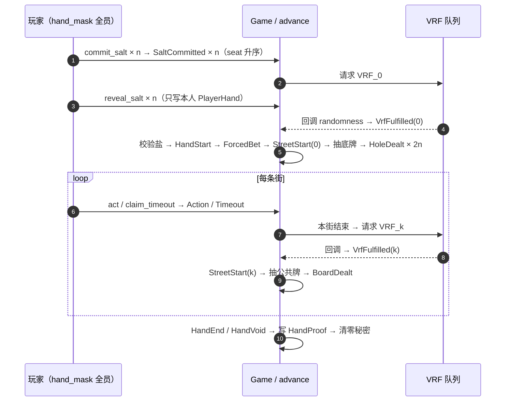

# solpoker 发牌协议：字节级规范 v1（Stage 4 定稿）

> **状态**：定稿 v1。本文取代 [stage1-design.md](design/stage1-design.md) §8 的设计级描述；§8 中凡与本文不一致之处，以本文为准。
> **配套交付物**：链上 Rust 实现 `crates/solpoker-core`、Python 参考实现 `reference/solpoker_deal.py`、测试向量 `vectors/v1/*.json`。CI 断言三者逐字节一致（§9.3）。
> **适用范围**：本文只规定字节编码、公式与验证流程，第三方据此可以独立复算并验证任何一手牌。链上的 PlayerHand 账户与发牌相关指令（`commit_salt`、`reveal_salt`、`advance` 的账户结构）随九席座位模型在 Stage 5/6 落地，不在本文范围内。

---

## 1. 范围与版本

**版本**：v1。所有带 `/v1` 的域分隔字符串和所有字节布局一经发布不得更改；任何改动都以 v2 另起新文档，历史手牌永远按 v1 验证。

**本文覆盖**：盐的承诺与揭示、种子体系、事件流规范编码、抽牌算法、验证流程、测试向量、安全性质。

**本文不覆盖**：链上指令的账户列表与权限检查（Stage 5/6）、VRF 请求/回调的 CPI 细节（设计文档 §9）、下注规则与结算/rake 算法（设计文档 §7，验证流程只引用其结果）。

### 1.1 从设计级 §8 到字节级 v1 的改动

| # | 改动 | 设计级 §8 | 字节级 v1 |
|---|---|---|---|
| C1 | 座位数 | 2 人，字段为 `[T; 2]` | 固定 9 个物理座位（D7），每手参与者用 `hand_mask`（u16）表示，2–9 人；数组一律 `[T; 9]` |
| C2 | 盐聚合 | `seed_k = sha256(VRF_k ‖ salt_0 ‖ salt_1)` | 引入 `salt_digest`，显式绑定 table、hand_id、hand_mask 和每个座位的 `(seat, occupancy_id, occupant, salt)`（§5.1） |
| C3 | 种子公式 | `sha256(VRF_k ‖ salt_0 ‖ salt_1)` | `seed_k = sha256("solpoker/seed/v1" ‖ VRF_k ‖ salt_digest)`，与设计 §8.3 逐字节一致（table/hand_id/hand_mask 经 salt_digest 传递绑定，§5.2） |
| C4 | 第一手庄位 | `HMAC(...)[0] & 1` | 取 HMAC 前 8 字节按大端读为 u64，对 `popcount(hand_mask)` 取模，映射到掩码中第几个置位（§5.3）；2 人时与原公式等价（mod 2 即取最低位，两种算法结果一致的约定见 §5.3） |
| C5 | 发底牌起点 | 「从 SB 开始」 | 统一为「button 顺时针下一位」（`next_clockwise`），2–9 人同一规则；heads-up 中 button = SB，第一张发给 BB（§7.3） |
| C6 | runout | 文字描述 | 定稿：`RunoutStarted` 事件 + 单次 VRF_r；runout 发出的牌 `street` 记实际牌位（1/2/3）、`vrf_src = 4`；`draw_no` 按牌位规范编号连续接续（§7.4） |
| C7 | 事件表 | 字段名列表 | 全部事件的字节级布局（§6.2），新增 `StreetSkipped` 的语义 |
| C8 | transcript_0 | 公式已有 | 钉死 `program_id` 为域的一部分（§6.1） |
| C9 | HandStart 位置 | 未规定 | 规范化为**事件流第一条**；其内容（尤其是第一手的 button）在 VRF_0 与全员盐齐备后计算——日志顺序是规范顺序，不代表计算时序（§6.3） |

---

## 2. 符号与编码约定

| 约定 | 含义 |
|---|---|
| `a ‖ b` | 字节串拼接 |
| 整数编码 | **所有整数一律大端**（big-endian），宽度按字段表；与「取哈希输出前 8 字节按大端读为 u64」保持一致 |
| 字符串常量 | 按 UTF-8 编码，**不带结尾 NUL**；本文用引号标出的字符串即其字面字节 |
| `sha256` | SHA-256，输出 32 字节 |
| `HMAC-SHA256(key, msg)` | RFC 2104；输出 32 字节；`out[i..j]` 指输出的字节区间（含 i 不含 j） |
| `BE_u64(b)` | 把 8 字节按大端解释为 u64 |
| 十六进制显示 | 本文与测试向量中的字节串一律小写 hex，不带 `0x` 前缀； prose 中的账户地址用 base58 |
| `table` | Table 账户地址，32 字节 |
| `program_id` | solpoker 程序地址，32 字节 |
| `hand_id` | u64，每手 +1，编码为 8 字节大端 |
| `player_i` / `occupant_i` | 座位 i 占用者的钱包公钥，32 字节（即使动作由 session key 签名，此处也用钱包地址） |
| `seat` | 物理座位号，u8，取值 0–8 |
| `hand_mask` | u16，bit i 置位表示座位 i 参与本手；必须满足 2 ≤ popcount ≤ 9 |

`next_clockwise(from, mask)`：从 `from` 起严格顺时针（座位号递增，8 之后绕回 0）找 `mask` 中下一个置位座位；`from` 本身不计入。参考实现见 `crates/solpoker-core/src/seats.rs`。

`nth_set_bit(mask, n)`：`mask` 中按座位号升序第 n 个（0 起）置位对应的座位号。

---

## 3. 牌与牌堆编码

一张牌一个字节：

```text
card = rank × 4 + suit
```

| rank | 2 | 3 | 4 | 5 | 6 | 7 | 8 | 9 | T | J | Q | K | A |
|---|---|---|---|---|---|---|---|---|---|---|---|---|---|
| 编码 | 0 | 1 | 2 | 3 | 4 | 5 | 6 | 7 | 8 | 9 | 10 | 11 | 12 |

| suit | ♣ | ♦ | ♥ | ♠ |
|---|---|---|---|---|
| 编码 | 0 | 1 | 2 | 3 |

- 合法牌值为 0–51；`0xFF` 保留为「无牌」标记（仅用于账户存储，绝不进入事件流与计算）。
- **牌堆**是有序列表，初始为 `[0, 1, …, 51]`（牌值升序）。每抽出一张即从列表中删除，不做整副洗牌。
- 记 `n` 为当前牌堆剩余张数。一手开始抽第一张前 `n = 52`。

---

## 4. 盐承诺与揭示

### 4.1 公式

```text
salt_i = 32 字节，每手由客户端或 agent SDK 用 CSPRNG 重新生成
C_i    = sha256("solpoker/salt/v1" ‖ table ‖ hand_id ‖ player_i ‖ salt_i)
```

### 4.2 协议级规则

1. 本手的参与者就是 `hand_mask` 中的座位；**只有 `hand_mask` 成员需要承诺**。
2. `commit_salt(hand_id, C_i)` 把承诺公开写入 `Game.seats[i]`；下一手的承诺可以在当前这手进行中预先提交。
3. **`hand_mask` 全员承诺齐后才请求 VRF_0**；VRF_0 的请求与盐的揭示并行开放。
4. `reveal_salt(hand_id, salt_i)` 只写本人的 PlayerHand（D6），不引用 Game。
5. 发牌的 `advance` 从各 PlayerHand 读出盐，逐一校验 `sha256(…) == C_i`。
6. **缺任一盐，整手作废**（`HandVoid{reason = 0}`），所有投入全额退回，缺盐者记一次超时；盐校验不匹配视同缺盐。
7. 承诺齐之后、VRF_0 到达之前，任何一方都无法改变种子：VRF 输出在请求时尚未产生，盐已被承诺锁定。
8. 盐按 **seat 升序**聚合（§5.1），不按位置（BTN/SB/BB）、不按承诺先后。每手只提交一次盐，各街复用。

---

## 5. 种子体系

### 5.1 盐摘要

```text
entry_i     = seat(u8) ‖ occupancy_id(u64) ‖ occupant(32) ‖ salt_i(32)   // 73 字节
salt_digest = sha256("solpoker/salts/v1" ‖ table ‖ hand_id ‖ hand_mask(u16)
                     ‖ entry_0 ‖ entry_1 ‖ … ‖ entry_{m-1})
```

- `entry_i` 按 **seat 升序**排列，覆盖 `hand_mask` 的全部 m = popcount 个座位。
- `occupancy_id` 取自本手开始时该座位 `SeatState.occupancy_id`，与 `HandStart` 事件中的值一致。换人后即使同一钱包再入座，occupancy_id 也不同，摘要必然不同。
- 一手之内 `salt_digest` 只计算一次，各街复用。

### 5.2 逐街种子

```text
seed_k = sha256("solpoker/seed/v1" ‖ VRF_k ‖ salt_digest)
```

（table、hand_id、hand_mask 的绑定由 `salt_digest` 传递带入——它与设计
文档 §8.3 的公式逐字节一致，不做额外绑定。）

| k | 街 | VRF 来源 | 用途 |
|---|---|---|---|
| 0 | 翻前 | VRF_0 | 发底牌；新组合第一手定庄位 |
| 1 | 翻牌 | VRF_1 | 3 张公共牌 |
| 2 | 转牌 | VRF_2 | 1 张公共牌 |
| 3 | 河牌 | VRF_3 | 1 张公共牌 |
| 4 | runout | VRF_r | all-in 合并后补发的全部剩余公共牌 |

`VRF_k` 是本街实际采用的那次回调的 32 字节 randomness（重试时以 `VrfFulfilled` 事件记录的 attempt 对应的那次为准；被忽略的迟到回调不参与计算）。

### 5.3 第一手庄位与轮转

**新组合的第一手**（任一座位的 `(occupant, occupancy_id)` 与上一手不同）：

```text
raw    = HMAC-SHA256(key = seed_0, msg = "solpoker-v1/button" ‖ table ‖ hand_id)
v      = BE_u64(raw[0..8])
button = nth_set_bit(hand_mask, v mod popcount(hand_mask))
```

- 取模偏差：popcount ≤ 9，被丢弃的相对概率质量 < 9 / 2^64，可忽略；此处不做拒绝采样（与抽牌不同，庄位只选一个值，且偏差上界可证明）。为确定性起见此规则钉死，不得「顺手」改成拒绝采样。
- 2 人时 `v mod 2` 等价于取 `v` 的最低位，即等价于设计级公式 `raw[0] & 1` 的约定推广。

**之后的每一手**：

```text
button_h = next_clockwise(button_{h-1}, hand_mask_h)
```

`button_{h-1}` 取上一手的座位号即可，无论该座位在新一手是否仍有人。换人导致的空座由 `next_clockwise` 自动跳过。

---

## 6. 事件流与规范编码

### 6.1 链式哈希

```text
transcript_0     = sha256("solpoker/transcript/v1" ‖ program_id ‖ table ‖ hand_id)
transcript_{n+1} = sha256(transcript_n ‖ encode(event_n))
```

`encode(event)` = `tag(u8) ‖ 固定宽度字段（全部大端）`。所有事件定长，无长度前缀、无分隔符。

`Game.events` 保存本手的完整事件列表（公开，上限约 128 条）；结算时 Game 被 commit，事件随提交历史留在 L1，索引器另存一份。`HandProof` 只保存 `transcript_final`。

### 6.2 事件总表

| tag | 事件 | 字段（顺序即编码顺序） | 总长度 |
|---|---|---|---|
| 0x01 | HandStart | hand_id u64, button u8, hand_mask u16, stack[9] u64, occupancy_id[9] u64 | 156 |
| 0x02 | SaltCommitted | seat u8, C_i 32 | 34 |
| 0x03 | VrfFulfilled | target u8, attempt u8 | 3 |
| 0x04 | ForcedBet | seat u8, kind u8, amount u64 | 11 |
| 0x05 | HoleDealt | seat u8, draw_no u16 | 4 |
| 0x06 | StreetStart | street u8 | 2 |
| 0x07 | Action | seat u8, kind u8, amount u64 | 11 |
| 0x08 | Timeout | seat u8, auto_kind u8 | 3 |
| 0x09 | BoardDealt | street u8, card u8, draw_no u16, vrf_src u8 | 6 |
| 0x0A | RunoutStarted | —（只有 tag） | 1 |
| 0x0B | StreetSkipped | street u8 | 2 |
| 0x0C | HandEnd | result u8, deltas[9] i64, rake u64 | 82 |
| 0x0D | HandVoid | reason u8 | 2 |

### 6.3 逐事件字段布局与语义

字节偏移从 tag（偏移 0，1 字节）之后起算。

**0x01 HandStart（156 字节）**

| 偏移 | 字段 | 类型 | 说明 |
|---|---|---|---|
| 1 | hand_id | u64 | 冗余于 transcript_0，用于事件列表独立可读 |
| 9 | button | u8 | 最终庄位（新组合第一手为 §5.3 的取值） |
| 10 | hand_mask | u16 | 本手参与者 |
| 12 | stack[9] | u64 × 9 | 各座位开手时筹码；不在 hand_mask 的座位为 0 |
| 84 | occupancy_id[9] | u64 × 9 | 不在 hand_mask 的座位为 0 |

追加时机：VRF_0 到达且全员盐校验通过之后、第一条 ForcedBet 之前（C9）。此前的承诺事件见下方规范顺序。

**0x02 SaltCommitted（34 字节）**：seat @1，C_i @2..33。追加时机：全员承诺齐时，**按 seat 升序一次性批量追加**（实时先后不进入 transcript）。预先提交的下一手承诺属于下一手的 transcript。

**0x03 VrfFulfilled（3 字节）**：target @1（0=翻前 1=翻牌 2=转牌 3=河牌 4=runout），attempt @2（实际采用的那次请求，1 起）。**不含 randomness 本身**——randomness 手牌结束后在 HandProof 公开。请求与重试不产生事件。

**0x04 ForcedBet（11 字节）**：seat @1，kind @2（0=ante，1=SB，2=BB），amount @3..10。顺序规范：先全员 ante（从 `next_clockwise(button)` 起顺时针），再 SB，再 BB。ante 是死钱。

**0x05 HoleDealt（4 字节）**：seat @1，draw_no @2..3。**不记牌面**。每人两张底牌产生两条事件。

**0x06 StreetStart（2 字节）**：street @1（0=翻前 1=翻牌 2=转牌 3=河牌）。标记一条街的阶段开始：**翻前在强制投入之后、HoleDealt 之前**；**翻牌/转牌/河牌在本街 VrfFulfilled 之后、BoardDealt 之前**（即先标记阶段，再发该街的牌；该街的下注动作跟在其后）。

**0x07 Action（11 字节）**：seat @1，kind @2，amount @3..10。

| kind | 含义 | amount |
|---|---|---|
| 0 | fold | 0 |
| 1 | check | 0 |
| 2 | call | 本轮实际跟注额 |
| 3 | bet | 本轮下注额加到的目标值 |
| 4 | raise | 本轮下注额加到的目标值 |
| 5 | all-in | 本轮下注额加到的目标值（= street_bet + 剩余 stack） |

**0x08 Timeout（3 字节）**：seat @1，auto_kind @2（0=check，1=fold）。由 `claim_timeout` 产生的自动动作记为 Timeout，不记为 Action。

**0x09 BoardDealt（6 字节）**：street @1，card @2，draw_no @3..4，vrf_src @5。

- street：该牌的实际牌位（1=翻牌，2=转牌，3=河牌）。runout 补发的牌也按实际牌位记录，逐街翻出时的观感与逐街发牌一致。
- vrf_src：该牌使用的种子的 k 值（0–4）。正常逐街发牌时 street 与 vrf_src 相同；runout 时 street=实际牌位、vrf_src=4。HandProof 的 `board_src` 与 vrf_src 一致。

**0x0A RunoutStarted（1 字节）**：本街下注结清、待回应清零、live ≥ 2 且 actionable ≤ 1 时追加，随后只请求一次 VRF_r。

**0x0B StreetSkipped（2 字节）**：street @1。runout 发生后，每一个不再存在下注轮的街（从 runout 起点到河牌之间）各追加一条，按街升序，在 HandEnd 之前。例如翻前 all-in：runout 发出 5 张后追加 StreetSkipped(1)、(2)、(3)。

**0x0C HandEnd（82 字节）**：result @1，deltas[9] i64 @2..73，rake u64 @74..81。

| result | 含义 |
|---|---|
| 0 | 未摊牌获胜（其余玩家全部弃牌） |
| 1 | 摊牌（含平分） |

`deltas[i]` 为座位 i 本手的净变动（含退回的未跟注部分；不在 hand_mask 的座位为 0）；恒有 `Σ deltas = −rake`。deltas 与 rake 的计算规则（主池/边池、奇数筹码顺时针发放）见设计文档 §7，不在本文范围，但验证时须重算并比对（§8 步骤 8）。

**0x0D HandVoid（2 字节）**：reason @1。

| reason | 含义 |
|---|---|
| 0 | missing_salt：缺盐或盐校验不匹配 |
| 1 | vrf_exhausted：VRF 重试用尽（默认 3 次） |

作废的手牌：全部投入（含 ante）退回，不收 rake；deltas 恒为 0，故不携带。

### 6.4 规范事件顺序

一手正常打到摊牌的事件流骨架（n = popcount(hand_mask)）：

```text
HandStart
SaltCommitted × n            （seat 升序）
VrfFulfilled(target=0)
ForcedBet(ante) × n          （button 顺时针下一位起，顺时针）
ForcedBet(SB), ForcedBet(BB)
StreetStart(0)
HoleDealt × 2n               （draw_no 升序）
(Action | Timeout) × …
VrfFulfilled(1), StreetStart(1), BoardDealt × 3
(Action | Timeout) × …
VrfFulfilled(2), StreetStart(2), BoardDealt × 1
(Action | Timeout) × …
VrfFulfilled(3), StreetStart(3), BoardDealt × 1
(Action | Timeout) × …
HandEnd
```

runout 变体（以翻牌圈 all-in 为例）：

```text
… StreetStart(1), BoardDealt × 3, Action(all-in), Action(call), RunoutStarted,
VrfFulfilled(4), BoardDealt(street=2), BoardDealt(street=3),   （转牌、河牌，vrf_src=4）
StreetSkipped(2), StreetSkipped(3), HandEnd
```

作废：`… HandVoid` 直接终结事件流（缺盐时可能只有 HandStart/SaltCommitted/VrfFulfilled 前缀）。



---

## 7. 抽牌算法

### 7.1 单次抽取

第 `draw_no` 张牌（retry 从 0 起，本张之内递增）：

```text
msg = "solpoker-v1" ‖ table ‖ hand_id(u64) ‖ draw_no(u16) ‖ retry(u16) ‖ transcript_digest(32)   // 87 字节
v   = BE_u64( HMAC-SHA256(key = seed_k, msg)[0..8] )
t   = 2^64 mod n                                // n = 当前牌堆剩余张数
if v < t:  retry += 1，用新的 retry 重算         // 拒绝采样，消除取模偏差
index = v mod n
card  = 有序牌堆中第 index 张（0 起），取出并删除
```

- `transcript_digest` 是**抽这一张之前**的 transcript 链当前值（§6.1）。
- 每抽出一张牌，立刻追加对应事件（底牌追加 `HoleDealt{seat, draw_no}`，公共牌追加 `BoardDealt{street, card, draw_no, vrf_src}`），所以**下一张牌绑定的 transcript 已经包含上一张**；公共牌的牌面也因此被后续所有抽取绑定。
- `retry` 是单张牌内部的计数；换下一张牌（draw_no +1）时归零。
- `2^64 mod n` 在 n ≤ 52 时恒小于 2^58，拒绝概率 < 2^-6，期望重算次数 < 1.02；实现不做循环上限，概率性终止。
- 不做整副洗牌；每张牌的开销是一次 HMAC 加可能的重算，常数级。

### 7.2 每张牌用哪个种子

| draw_no | 牌 | 正常种子 | runout 中的种子 |
|---|---|---|---|
| 0 … 2n−1 | 底牌（两轮） | seed_0 | 不涉及（runout 不会在发底牌前发生） |
| 2n … 2n+2 | 翻牌 3 张 | seed_1 | seed_r |
| 2n+3 | 转牌 | seed_2 | seed_r |
| 2n+4 | 河牌 | seed_3 | seed_r |

### 7.3 发牌顺序

令 n = popcount(hand_mask)，定义顺时针座位序列：

```text
s_0     = next_clockwise(button, hand_mask)      // button 左侧第一位
s_{j+1} = next_clockwise(s_j, hand_mask)
```

- **底牌**：draw_no = j（0 ≤ j < 2n）发给座位 `s_{j mod n}`，是该座位的第 `j div n` 张底牌（0 起）。即「button 左侧第一位起，顺时针，每人一张，共两轮」。heads-up 中 button = SB，第一张（draw_no 0）发给 BB。
- **公共牌**：按 draw_no 升序直接发出，与座位无关。
- 不发切牌/烧牌（burn card）；牌堆中不移除任何未发出的牌。

### 7.4 runout 合并

触发条件（本街下注结清后）：待回应清零、live ≥ 2、actionable ≤ 1。此时：

1. 追加 `RunoutStarted`；
2. 只请求一次 VRF_r，得 seed_r（k = 4）；
3. 按 §7.2 的规范 draw_no 把剩余公共牌一次性抽完：每张牌仍遵循「先抽牌、追加 BoardDealt、再抽下一张」的 transcript 绑定，draw_no 取牌位的规范值（翻牌 2n…2n+2、转牌 2n+3、河牌 2n+4 中尚未发出的部分），**编号天然连续接续，不设独立计数器**；
4. 这些 BoardDealt 的 `street` 记实际牌位（1/2/3）、`vrf_src = 4`；
5. 对每一个被跳过的下注轮追加 `StreetSkipped`（§6.3）；
6. 前端按 RunoutStarted 时的 board_len 分组（翻牌 3 张、转牌、河牌）逐街翻出，不影响编码。

live = 1（其余全弃牌）时不进入 runout，直接结算。

---

## 8. 验证流程

任何人拿到一手的证明数据后，按以下步骤复算。数据来源：HandProof 账户（最近 16 手环形缓冲）、L1 提交历史中的 Game 快照（含完整事件列表）、或索引器副本。

**输入**（ProofEntry 加事件列表）：`table`、`program_id`、`hand_id`、`hand_mask`、各座位 `occupant` / `occupancy_id`、各参与者 `salt_i`、用到的全部 `VRF_k` 及各自实际采用的 attempt、`board`、各参与者底牌、`deltas`、`rake`、`transcript_final`、本手完整事件列表。

1. **形状检查**：2 ≤ popcount(hand_mask) ≤ 9；事件列表中 HandStart 的 `hand_id`、`hand_mask`、`occupancy_id[]` 与证明一致；不在 hand_mask 的座位 stack/occupancy_id/deltas 为 0。
2. **盐校验**：对事件列表中的每条 `SaltCommitted`，用 §4.1 公式和证明中的 `salt_i` 重算 `C_i`，逐字节比对；确认 SaltCommitted 恰好覆盖 hand_mask 全员、按 seat 升序排列。
3. **摘要与种子**：按 §5.1 重算 `salt_digest`；对每个用到的 k 按 §5.2 重算 `seed_k`。
4. **transcript**：从 `transcript_0` 起按事件列表逐条编码并链式哈希（§6.1–6.3），结果必须等于 `transcript_final`。
5. **庄位**：新组合第一手按 §5.3 重算 button，与 HandStart.button 比对；否则检查 button 等于上一手 button 对新 hand_mask 的 `next_clockwise`。
6. **逐张重抽**：按 §7 从空牌堆起，沿事件流维护 transcript，对每条 `HoleDealt`/`BoardDealt` 重算抽牌，验证抽出的牌与证明中的底牌/公共牌一致，且 seat、draw_no、vrf_src 与事件一致；确认 draw_no 编号符合 §7.2–7.4。
7. **VRF 来源**：对每个用到的 k，按 `caller_seed = sha256("solpoker/vrf/v1" ‖ table ‖ hand_id ‖ k ‖ attempt)` 在 VRF 程序的链上记录中确认该 randomness 确实是对应请求的回调结果；attempt 必须与对应 `VrfFulfilled` 事件一致。
8. **结算**：按设计文档 §7 的规则（含主池/边池、奇数筹码、rake 公式）从事件流重算 `deltas` 与 `rake`，与 HandEnd 事件及证明比对；作废手确认 `HandVoid` 原因合法（缺盐事件缺失或 VRF 重试次数耗尽）。
9. **全部通过**才算这手牌有效；任何一步不符即判定证明无效。

`reference/solpoker_deal.py` 是上述流程的参考实现；前端「验证这一手」调用同一套逻辑。

---

## 9. 测试向量

### 9.1 向量文件

`vectors/v1/` 下每个 JSON 文件包含：全部输入（table、program_id、hand_id、hand_mask、座位身份与 occupancy_id、盐、VRF 输出与 attempt、动作序列）、全部中间值（每个 `C_i`、`salt_digest`、各 `seed_k`、每条事件后的 transcript、每次抽取的 msg/v/retry/index）、以及最终输出（底牌、公共牌、transcript_final、deltas、rake）。

| 文件 | 覆盖点 |
|---|---|
| `hu_2p.json` | 2 人桌（heads-up 特例）：button = SB，第一张底牌发 BB；逐街 VRF，打到摊牌 |
| `3p_sparse.json` | 3 人稀疏座位（如 0、4、8）：`next_clockwise` 跳空座、发牌顺序、SB/BB 定位 |
| `9p_full.json` | 9 人满桌（hand_mask = 0x1FF）：两轮共 18 张底牌、9 人 ante |
| `button_rotation.json` | 新组合第一手的 button_pick，以及 hand_mask 变化（有人离桌）下的多手轮转 |
| `runout.json` | 翻前/翻牌圈 all-in 合并：RunoutStarted、seed_r 连抽、draw_no 规范编号接续、StreetSkipped |
| `redraw.json` | 拒绝采样：构造使 `v < 2^64 mod n` 的种子，验证 retry 递增与重算路径 |

### 9.2 向量格式约定

- 字节串一律小写 hex，无前缀；整数为十进制 JSON number（u64/i64 范围内）。
- 事件同时给出结构化字段和编码后的 hex，便于定位分歧。

### 9.3 三方逐字节一致

以下三处对同一输入必须产生**逐字节相同**的输出（哈希、事件编码、抽牌结果、最终 transcript）：

1. 链上 Rust 实现 `crates/solpoker-core`；
2. Python 参考实现 `reference/solpoker_deal.py`；
3. 测试向量 `vectors/v1/*.json`。

CI 对全部向量执行两个方向：Rust 复算并与向量比对；Python 复算并与向量比对。任何一方不一致即构建失败。向量本身不手写：由参考实现生成、经 Rust 复算确认后入库钉死。

---

## 10. 安全性质

**主张**

1. **可证明公平（种子不可操纵）**：`seed_k` 同时绑定本街 VRF 输出和全员盐。盐在 VRF_0 请求之前已全部承诺锁定，VRF 输出在请求时尚不存在。只要 **VRF 预言机诚实，或至少一名参与者用 CSPRNG 诚实生成了自己的盐**，任何单方（运营方、TEE 运营者、其他玩家）都无法把 seed_0 偏向任何分布，底牌对所有缺失信息方均匀。同理，任一街的 `seed_k`（k ≥ 1）只要求 VRF_k 在请求前不可预测、且 salt_digest 在请求前已固定——后者由盐承诺保证。
2. **未来的牌不存在**：不做整副洗牌，牌堆没有预先生成的「牌序」。每条街的牌在该街 VRF 到达后才被定义，因此即使 seed_0 或已发出的牌泄露（如 TEE 被攻破），也无法推出任何尚未发出的公共牌。
3. **transcript 绑定防重排**：每次抽牌的消息都包含当时的 transcript 链值，而 transcript 以密码学方式累积了全部历史事件（承诺、VRF 到达、强制注、动作、已发的牌）。任何对事件顺序、动作、牌面的篡改都会改变之后所有抽牌，验证立即失败；也无法在两段等价历史之间挑选对自己有利的一条。
4. **无取模偏差**：抽牌使用拒绝采样（§7.1），在均匀种子下每张剩余牌等概。庄位选择的取模偏差有显式上界（§5.3）。
5. **全员绑定**：缺任一盐整手作废（§4.2），所以「与部分玩家串谋」无法定型一副牌——任何一名诚实玩家的盐都足以使种子不可预测。
6. **可独立审计**：验证一手牌只需要公开数据（§8），不需要信任运营方、索引器或 TEE。

**不主张**

- **底牌保密性**：对局期间的底牌保密由 TEE + PER 权限层保证，属信任模型（设计文档 §16），不在本协议的可证明范围内。
- **VRF 活性与抗审查**：VRF 长时间不回调会导致作废退款；本协议不保证一手牌一定打完，只保证打完的牌可验证、作废的手不亏钱。
- **TEE 执行正确性**：结算规则的正确执行依赖 TEE；但执行结果全部落到事件流与 HandProof，任何偏离 §7/§6.3 的执行都无法通过 §8 的复算。
- **拒绝揭示的拒绝服务**：玩家可以不揭示盐逼作废（付出超时记次的代价）；本协议只保证这种行为无法获利。
- **侧信道**：计时、流量分析等侧信道不在范围内。
