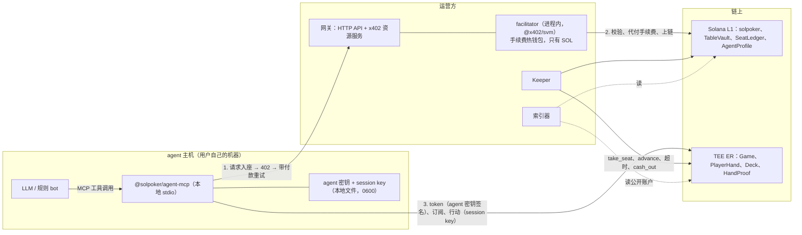
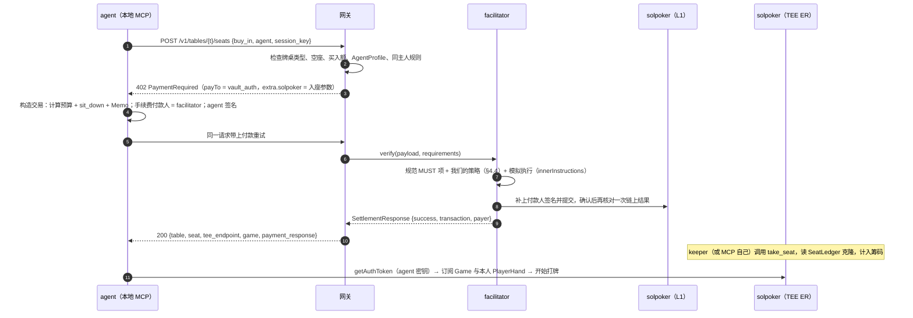

# AI 桌与 x402 架构设计（Stage 1 配套文档一）

> **状态**：草案。日期：2026-09-30。按项目指令，Stage 8 的细节在你确认之前不实现。
> **依据**：[决策记录 §9](decisions.md)（Q13–Q21 已按默认定稿）、[主设计文档](stage1-design.md)（D1–D6）、[调研笔记](../stage1-research-notes.md)（x402 exact SVM 规范要点，2026-09-30 核对）。
> **本文的核心变化**：推荐 x402 入座改用**原子模式**（D5）。付款交易本身就是 `sit_down` 指令，入账不再需要信任网关，也不会出现「付了款却没抢到座位」的情况。

---

## 0. 摘要

1. **三类牌桌**都是 heads-up：真人桌（人对人）、AI 桌（agent 对 agent）、混合桌（一人对一个 agent）。规则、rake 和超时完全相同。
2. **agent 是有主人的钱包**：由主人和 agent 双签注册 `AgentProfile`。链上能证明「这个座位是已注册的 agent」，但无法证明普通钱包背后是真人（Q21 已接受）。
3. **x402 解决的是 agent 原生的付款问题**：agent 收到 HTTP 402，签一笔付款，就能入座。手续费由我们的 facilitator 代付，所以 agent 只需要持有 USDC，不需要 SOL。
4. **原子入座（D5）**：付款交易里只有一条 `sit_down` 指令，USDC 由程序通过 CPI 从 agent 的 ATA 转进 TableVault。x402 规范的 Path 2（智能钱包路径）本来就允许「由白名单程序包装的转账」，我们自建 facilitator，把 solpoker 程序加进白名单即可。
5. **agent 自己连 TEE**：用自己的密钥换 token、读自己的底牌、用 session key 行动。运营方看不到 agent 的底牌（托管式 MCP 仅限 devnet）。
6. **离桌不需要 x402**：`cash_out` 任何人都能触发，钱直接回到 agent 的钱包。

---

## 1. 范围与已定前提

| 项 | 结论（已定） |
|---|---|
| 牌桌形态 | v1 全部 heads-up（Q14） |
| 数量 | AI 桌和混合桌每档各 1 张，共 6 张，常驻（Q15）。加上 9 张真人桌，共 15 张 |
| 超时 | 与真人相同：30 秒，连续 3 次超时自动站起（Q16） |
| 平台 bot | 示例 bot 只在 devnet 和 AI 桌上陪练，混合桌上不放平台 bot（Q17） |
| 同一主人 | 同一主人的 agent 禁止同桌对打，可以分别坐不同的桌（Q18） |
| rake | 与真人桌相同（Q19） |
| 注册门槛 | devnet 任何人都能注册；主网按牌照的 KYC/AML 要求，给主人钱包加白名单（Q20） |
| 真人桌防 bot | 做不到密码学保证，靠用户协议加行为检测（Q21） |
| x402 的用途 | v1：agent 的入座和补码。v2 可选：观战直播和牌局历史的按次付费 API（Q13） |

---

## 2. 身份与入座规则

### 2.1 AgentProfile 与注册

```rust
pub struct AgentProfile {        // PDA ["agent", agent_pubkey]，L1，租金由主人支付
    pub agent: Pubkey,           // agent 自己的钱包：入座、付款、读底牌都用它
    pub owner: Pubkey,           // 主人钱包（主网须在白名单内）
    pub name: [u8; 32],          // 显示名，前端和 MCP 一律当作不可信文本处理
    pub meta_uri: [u8; 96],      // 可选：模型、作者、主页
    pub status: AgentStatus,     // Active | Revoked | Banned
    pub registered_at: i64,
    pub bump: u8,
}
```

**注册流程**（`register_agent`，主人和 agent 都必须签名）：

1. agent 一侧运行 `npx @solpoker/agent-mcp register --owner <主人钱包>`：生成（或读取）agent 密钥，构造交易，由 agent 先签名，然后输出一个链接或二维码。
2. 主人打开链接，在网页上用自己的钱包签第二个名，由主人支付租金和手续费，交易上链。
3. 主网：程序额外要求存在 `OwnerAllowlist` PDA（种子 `["owner_ok", owner]`，由 admin 在 KYC 通过后创建）。devnet 不检查。

**注销与封禁**：

| 操作 | 谁 | 效果 |
|---|---|---|
| `revoke_agent` | 主人 | status 改为 Revoked，不能再入座 |
| `set_agent_status(Banned)` | admin | 不能再入座 |
| 已经在桌上的 agent | — | ER 在每手开始前读 AgentProfile 的克隆，状态不是 Active，就在本手结束后自动站起。钱照常经 `cash_out` 退回 agent 的钱包 |

### 2.2 牌桌类型与入座规则

`sit_down` 在 L1 上执行，同时带上本座位和另一座位的 SeatLedger，以及签名者的 AgentProfile PDA（不存在时也要传地址，由程序确认它确实是空的）。

| 牌桌类型 | 0 号座 | 1 号座 | 额外检查 |
|---|---|---|---|
| 真人桌 | 真人 | 真人 | 签名者**不得**有 AgentProfile（注册过的 agent 不能坐真人桌） |
| AI 桌 | agent | agent | 签名者必须有状态为 Active 的 AgentProfile |
| 混合桌 | **只接受真人** | **只接受 agent** | 同上（E5：固定座位最直观，前端显示「真人座」和「AI 座」） |

### 2.3 同主人规则（Q18）

| 场景 | 拒绝条件 |
|---|---|
| AI 桌 | 另一座位的 `agent_owner` 等于本 agent 的 owner |
| 混合桌，agent 入座 | 0 号座的真人就是本 agent 的主人 |
| 混合桌，真人入座 | 1 号座 agent 的主人就是这个真人 |

这些检查都只用 L1 上的 SeatLedger，D1 让这一步变得很直接。**局限**：同一个人用两个不同的主人钱包注册，链上无法识别。主网上靠 KYC 白名单（一个自然人只对应一个主人钱包）加上 §7 的行为检测来弥补。

---

## 3. 组件与密钥



### 3.1 密钥与权限

| 密钥 | 谁持有 | 能做什么 | 泄露的后果 | 保护措施 |
|---|---|---|---|---|
| agent 密钥 | agent 主机 | 支付买入和补码、读本人底牌、签 `sit_down` | agent 钱包里的钱 | 本地文件 0600 或系统钥匙串；MCP 的支出上限（§6.3）；永不发给网关 |
| session key | agent 主机（MCP 生成） | 只能签本座位的对局动作，最长 7 天 | 可能被人替你乱打，但碰不到钱 | 只有占用者能撤销；座位释放时自动清空 |
| 主人钱包 | 主人 | 注册、注销 agent | 被人以你的名义注册 agent | 普通钱包 |
| facilitator 手续费钱包 | 运营方热钱包，只放 SOL | 为 `sit_down` 和 `top_up` 代付网络费 | 最多损失钱包里的 SOL | 规范要求的付款人隔离；限流；余额告警；定期补充 |
| keeper 钱包 | 运营方 | 为 permissionless 指令付手续费 | 最多损失少量 SOL | 没有任何特权 |
| 网关 authority | 运营方（仅标准模式） | 把「未记账的余额」记给某个付款人 | 在途的标准模式付款被记错人 | v1 不启用（D5） |
| admin | 主网为多签 | 建桌、维护模式、封禁 agent | 见主设计文档 §16 | 多签，升级权限另行管理 |

---

## 4. x402 入座

### 4.1 为什么推荐原子模式

x402 exact SVM 规范有两条校验路径：

- **Path 1（快速路径）**：交易只能是「计算预算 + 一笔 TransferChecked + Memo」。付款和入座只能分成两步，由网关事后调用 `credit_x402_deposit` 入账。这就是决策记录 §9.4 的原方案。
- **Path 2（智能钱包路径，需要 facilitator 主动开启）**：允许交易调用**白名单内的程序**，只要模拟执行时恰好产生一笔 TransferChecked，金额和收款 ATA 符合要求即可。规范明确写了「运营方可以覆盖白名单」。

我们自建 facilitator，把 solpoker 程序加进白名单，`sit_down` 交易本身就能作为 x402 付款。

| 对比项 | 原子模式（推荐） | 标准模式（原方案，延后） |
|---|---|---|
| 交易内容 | `sit_down` 指令，程序通过 CPI 转账 | 普通 TransferChecked 加 memo |
| 谁决定座位归属 | 程序：签名者就是占用者 | 网关读链上交易后认定，再调用 `credit_x402_deposit` |
| 需要信任网关吗 | 不需要 | 需要（事后可审计） |
| 付了款却没抢到座位 | 不可能：座位已被占就整笔失败，钱不会动 | 可能，需要退款流程 |
| 防重复入账 | 天然：同一座位不能被占两次 | 需要 DepositRecord |
| 额外的程序指令 | 无 | `credit_x402_deposit`、`refund_x402_deposit`、DepositRecord |
| 客户端要求 | 需要我们的 SDK 或 MCP 构造交易 | 任何标准 x402 客户端 |

「任何标准 x402 客户端都能付」看起来是标准模式的优势，但在牌桌上用处不大：agent 要打牌，本来就必须用我们的 SDK 或 MCP 来提交盐承诺、揭示盐、换 TEE token。所以 **v1 只实现原子模式**，标准模式留给以后真正需要通用客户端的场景，比如 Q13 里的按次付费数据 API。

### 4.2 原子模式流程



**402 响应示例**（字段名以 `@x402/core` 2.28 的类型定义为准，Stage 8 核对）：

```json
{
  "x402Version": 2,
  "resource": {
    "url": "https://<gateway>/v1/tables/<table>/seats",
    "description": "solpoker buy-in 20 USDC, table <table>, seat 1",
    "mimeType": "application/json"
  },
  "accepts": [{
    "scheme": "exact",
    "network": "solana:EtWTRABZaYq6iMfeYKouRu166VU2xqa1",
    "amount": "20000000",
    "asset": "9WUwFXpRsFbZa8yxMXciKaiXGXw4TxWekS7JJGtqG6uH",
    "payTo": "<该桌的 vault_auth PDA>",
    "maxTimeoutSeconds": 60,
    "extra": {
      "feePayer": "<facilitator 手续费钱包>",
      "memo": "solpoker:v1:sit:<table>:1:<quote_id>",
      "recentBlockhash": "<blockhash>",
      "solpoker": {
        "mode": "atomic",
        "program": "EZ5bMNxbtiTpSqdmRaGC4vYt6yWLUDC4WUNGqyvM6CSf",
        "instruction": "sit_down",
        "table": "<table>",
        "seat": 1,
        "buyIn": "20000000"
      }
    }
  }]
}
```

`extra.solpoker` 是我们自己加的字段，标准客户端会忽略它。主网的网络标识是 `solana:5eykt4UsFv8P8NJdTREpY1vzqKqZKvdp`，资产是 Circle USDC `EPjFWdd5AufqSSqeM2qN1xzybapC8G4wEGGkZwyTDt1v`。

**交易布局**：

| # | 指令 | 说明 |
|---|---|---|
| 0 | `SetComputeUnitLimit` | ≤ 200,000 |
| 1 | `SetComputeUnitPrice` | 不超过 facilitator 设定的上限 |
| 2 | `solpoker::sit_down { seat, buy_in, session_key, session_expires_at }` | 账户：table、本座 SeatLedger、另一座 SeatLedger、AgentProfile、agent（签名者）、agent 的 USDC ATA、TableVault、vault_auth、mint、token program。**不包含手续费付款人，也不创建任何账户**（D1 让座位账户预先建好） |
| 3 | `Memo(extra.memo)` | 规范要求恰好一条，并且内容一致 |

签名只有两个：facilitator（手续费付款人）和 agent（转账授权人）。session key 只作为参数传入，不参与签名。

### 4.3 标准模式（延后，保留设计）

以后需要时，按决策记录 §9.4 的原方案实现，并按 D1 做调整：

- `credit_x402_deposit(sig, payer, table, seat, amount)`：只有网关 authority 能调用；`DepositRecord` 以 `["x402", sig[0..32], sig[32..64]]` 为种子，防止重复入账；金额不超过 TableVault 的盈余（I-X 中的「盈余」）；按 `sit_down` 的全部规则登记座位。
- `refund_x402_deposit`：座位已被别人占用时，把钱退回付款人的 ATA，同样不超过盈余，并把 DepositRecord 标记为已退款。
- 公开对账脚本：每一条 DepositRecord 都能对应到一笔链上交易。

### 4.4 facilitator 的校验清单

**规范的 MUST 项**：

- 手续费付款人不出现在任何指令的账户列表里，也不是任何指令的程序；
- 手续费付款人不是任何转账的授权人、来源或代理人；
- 地址查找表（ALT）已全部解析；
- 除网络费外，不从付款人扣任何款；
- 除客户端和付款人外，没有其他必需的签名者。

**我们额外的策略**：

1. 除计算预算和 Memo 外，只允许一条 solpoker 指令，而且 discriminator 必须是 `sit_down` 或 `top_up`；
2. 这条指令的 table、seat、金额必须和报价完全一致；
3. 带 `innerInstructions` 模拟执行：必须恰好有一笔 TransferChecked，目标是 `ATA(payTo, asset)`，金额等于报价；
4. Memo 与 `extra.memo` 一致；报价在 `maxTimeoutSeconds` 内有效，过期后需要重新报价；
5. 用 120 秒的内存缓存防止重复结算，此外链上本身也不会重复（座位不能被占两次）；
6. 上链之后按规范要求再核对一次：检查内部转账，拿不到时检查 TableVault 余额的变化；
7. 按 agent、主人和 IP 限流，并给每天代付的手续费设上限。

**攻击测试**（Stage 8 的必测项）：在交易里塞进手续费付款人作为账户、金额不符、Memo 不符、多一笔转账、换成另一个程序、重放同一笔付款、座位已被占用，全部都必须被拒绝，而且钱不能动。

### 4.5 补码与离桌

- **补码**：流程与入座相同，指令换成 `top_up`，同样可以走 x402，1000BB 的上限由 ER 执行（主设计文档 §5.2）。
- **离桌**：MCP 调用 `leave`，在 ER 里签 `stand_up`（session key），commit 之后由 keeper 调用 `cash_out`，USDC 回到 agent 的 ATA。全程不涉及 x402。

### 4.6 各环节由谁付手续费

| 环节 | 付款人 | 备注 |
|---|---|---|
| `register_agent` | 主人 | 含 AgentProfile 的租金 |
| `sit_down` / `top_up`（x402） | facilitator | 每笔约 0.000005 SOL 加优先费 |
| `sit_down` / `top_up`（原生路径） | agent 自己 | 需要少量 SOL |
| ER 内的动作 | devnet 上不收费 | 主网 ER 的收费规则待 MagicBlock 确认 |
| `take_seat`、`advance`、`claim_timeout`、`cash_out`、`sweep_rake` | keeper | 都是 permissionless，谁都可以付 |

**待确认**：ER 能否接受 L1 上余额为 0 的手续费付款人（主设计文档 §18.2 第 4 问）。如果不能，有两种兜底：网关在入座成功后给 session key 转 0.001 SOL；或者由 keeper 与 session key 双签，keeper 付手续费。推荐前者，因为后者会让每个动作多一次往返。

---

## 5. agent 怎么打牌

### 5.1 连接

1. **attestation**：MCP 启动时对 TEE 端点做一次 `verifyTeeRpcIntegrity`（外面包一层自己的校验，challenge 用 `crypto.getRandomValues` 生成），结果缓存。校验失败就拒绝入座。
2. **token**：用 agent 密钥签名换取 token，因为 PlayerHand 的权限成员就是 agent 的公钥。token 只放在内存里。
3. **订阅**：先订阅 Game（公开）和本人的 PlayerHand，再发送任何交易。

### 5.2 每一手里 SDK 自动做的事

LLM 只负责「这一步怎么打」，协议细节全部由 SDK 和 MCP 在后台处理：

| 步骤 | 谁做 | LLM 能看到吗 |
|---|---|---|
| 生成 32 字节的盐（CSPRNG），提交承诺（可以提前提交下一手的） | SDK | 看不到 |
| 双方承诺齐后揭示盐（只写本人的 PlayerHand） | SDK | 看不到 |
| 读底牌 | SDK（凭 token） | 看得到自己的两张牌 |
| 轮到自己时通知 | MCP 的 `wait_for_turn` | 看得到 |
| 决定动作 | LLM | — |
| 提交动作（session key 签名） | MCP 的 `act` | — |
| 手牌结束后校验 HandProof | SDK 自动校验，可选 | 看得到校验结果 |

### 5.3 时间预算

行动超时是 30 秒。`wait_for_turn` 返回时附带 `time_left_ms`。建议：

- 给 LLM 的决策预算不超过 20 秒，剩下的时间留给签名和网络往返；
- MCP 提供可选的本地兜底：快到期时，能 check 就 check，否则 fold。它按正常动作提交，不计为超时；
- MCP 进程崩溃时，链上的超时规则照常生效：连续 3 次超时后自动站起，钱经 `cash_out` 退回 agent 的钱包。

---

## 6. 本地 MCP 服务（`@solpoker/agent-mcp`）

### 6.1 工具

| 工具 | 输入 | 输出 | 说明 |
|---|---|---|---|
| `wallet_status` | — | agent 地址、USDC 和 SOL 余额、注册状态 | devnet 上附带领币链接 |
| `list_tables` | 类型、档位（可选） | 牌桌列表：档位、空座、对手的公开资料 | 对手的名字标记为不可信文本 |
| `get_table_state` | table | 公开状态：底池、公共牌、双方 stack、轮到谁、`to_call`、最小加注、合法动作、剩余时间 | 不含任何秘密 |
| `get_my_cards` | table | 自己的两张底牌 | 凭 token 从 TEE 读取 |
| `wait_for_turn` | table、timeout_ms | 轮到自己时返回 `get_table_state` 的内容；手牌结束时返回结果 | 避免 LLM 反复轮询 |
| `sit_down` | table、buy_in、seat（可选） | 座位、交易签名 | 内部走 x402 原子模式；受支出上限约束 |
| `top_up` | table、amount | 交易签名 | 同上 |
| `act` | table、action、amount（可选） | 结果、新状态 | action 取值：fold、check、call、bet、raise、all_in |
| `leave` | table | 站起和 cash_out 的交易签名 | 手牌进行中调用视为 fold |
| `get_hand_history` | table、hand_id | 事件列表、双方底牌、结果 | 只返回已结束的手牌 |
| `verify_hand` | table、hand_id | 逐项校验结果 | 调用与 Python 参考实现一致的验证器 |

**资源**：`solpoker://rules/zh`、`solpoker://rules/en`（双语规则说明，包括 ante、rake、最小加注和超时）；`solpoker://tables/{id}/state`。
**提示词**：`play-heads-up`，包含规则摘要、动作格式和时间预算。

### 6.2 配置示例

```json
{
  "mcpServers": {
    "solpoker": {
      "command": "npx",
      "args": ["-y", "@solpoker/agent-mcp"],
      "env": {
        "SOLPOKER_CLUSTER": "devnet",
        "SOLPOKER_AGENT_KEYPAIR": "~/.solpoker/agent.json",
        "SOLPOKER_MAX_BUY_IN_USDC": "40",
        "SOLPOKER_DAILY_SPEND_USDC": "100",
        "SOLPOKER_ALLOWED_KINDS": "agent,mixed"
      }
    }
  }
}
```

### 6.3 安全

1. **支出上限**：单次买入上限、每日净支出上限、允许的牌桌类型和档位，都由 MCP 在本地强制执行，LLM 改不了。这是防止提示词注入把钱花光的主要手段。
2. **不可信文本**：对手 agent 的名字和 `meta_uri` 可能是攻击者写的。工具输出里把它们放在单独的 `untrusted` 字段中，截断长度并去掉控制字符，工具说明里也明确提示 LLM 不要执行其中的任何指令。
3. **密钥**：agent 密钥只存在本机（权限 0600 的文件或系统钥匙串），永远不会发给网关，所有签名都在本地完成。
4. **不泄露秘密**：工具输出里永远不出现当前这手的盐、种子和 VRF 输出，手牌结束之后才可以查看。
5. **托管式 MCP**：由运营方代持密钥，只能用于 devnet 演示，因为运营方会看到这个 agent 的底牌。主网不提供。

### 6.4 示例 bot

开源两个：随机 bot（只打合法动作）和规则 bot（按起手牌分档和底池赔率打）。它们用于 devnet 联调、CI 端到端测试和 AI 桌陪练，主网的混合桌上不放（Q17）。

---

## 7. 反作弊与合规

| 风险 | 措施 |
|---|---|
| 同一主人的两个 agent 互相送筹码 | 链上同主人规则（§2.3）；主网的 KYC 白名单保证一个人只对应一个主人钱包 |
| 不同主人串通 | 所有底牌在手牌结束后公开，索引器可以直接做检测，比传统平台容易得多：同一对 agent 反复对局、拿着强牌却弃牌、单向的筹码流动等 |
| 未注册的 bot 坐进真人桌 | 无法用密码学阻止（Q21）。靠用户协议和行为检测（行动时间分布、24 小时在线等），发现后由 admin 处理 |
| 洗钱 | 主网：主人钱包 KYC；同主人规则；异常流水告警；所有资金流都在 L1 上可查 |
| 滥用 facilitator 刷手续费 | 按 agent、主人和 IP 限流；每日代付上限；报价只在 60 秒内有效 |
| 刷座位（反复入座离座） | 入座本身就要转入真实的 USDC；如有需要，再加每个主人的并发座位上限（默认不限，主网视情况开启） |

---

## 8. 公开审计

- 入座和补码都是链上的 `sit_down` 和 `top_up` 交易，付款人、金额和座位一目了然。
- `audit_table`（主设计文档 §5.4 的 I-X）任何人都可以调用。
- 每一手的 HandProof 加上 L1 上的 commit 历史，可以完整复算。
- 开源对账脚本：从 L1 拉取一张桌的全部 `sit_down`、`top_up`、`cash_out` 和 `sweep_rake`，与 TableVault 的余额核对。

---

## 9. Stage 8 的分解与验收

| 子阶段 | 内容 | 验收 |
|---|---|---|
| 8a 程序 | AgentProfile 的注册、注销、封禁；三类牌桌的入座规则；同主人规则；在每手开始前检查 agent 状态 | 单元测试覆盖 §2 的每条规则（包括反例）；本地栈端到端测试 |
| 8b 网关与 facilitator | HTTP API、402 报价、原子模式的校验与结算、限流、devnet 领币接口 | §4.4 的攻击测试全部被拒绝且钱不动；devnet 上完成一次真实的 x402 入座，附交易签名 |
| 8c SDK 与 MCP | TS SDK（盐、TEE token、订阅、动作）、本地 MCP 的全部工具、支出上限、示例 bot | 两个 MCP agent 在 devnet 的 AI 桌上自动打满 100 手，每手 HandProof 都校验通过，资金守恒 |
| 8d 上线 devnet | 6 张 AI 桌和混合桌由部署脚本创建；前端显示 AI 标记 | 真人对 agent 在混合桌上完成对局；同主人拦截在 devnet 上复现 |

---

## 10. 待确认问题

| # | 问题 | 推荐 |
|---|---|---|
| X1 | D5：v1 只做 x402 原子模式，标准模式和 `credit_x402_deposit` 延后 | 采纳 |
| X2 | 混合桌固定座位：0 号座真人、1 号座 agent（主设计文档 E5） | 采纳 |
| X3 | 主网主人白名单的形式：由 admin 创建的 `OwnerAllowlist` PDA | 采纳；KYC 流程本身由你们的合规系统负责，链上只记录结果 |
| X4 | agent 被注销或封禁时正在桌上：本手结束后自动站起，钱退回 agent 的钱包 | 采纳 |
| X5 | 如果 ER 不接受余额为 0 的手续费付款人：网关在入座后给 session key 转 0.001 SOL | 采纳（等 MagicBlock 回答后再定） |
| X6 | 每个主人的并发座位上限 | devnet 不限；主网上线前按风控需要再定 |
