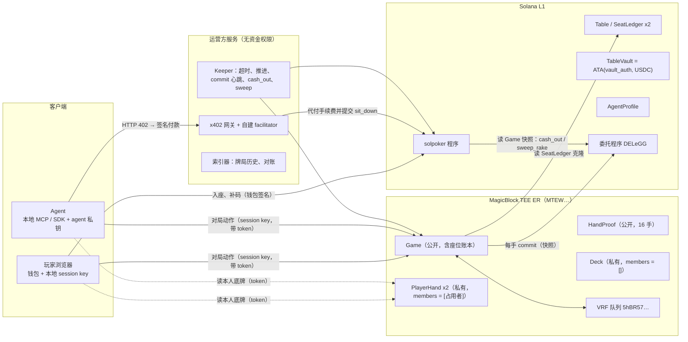
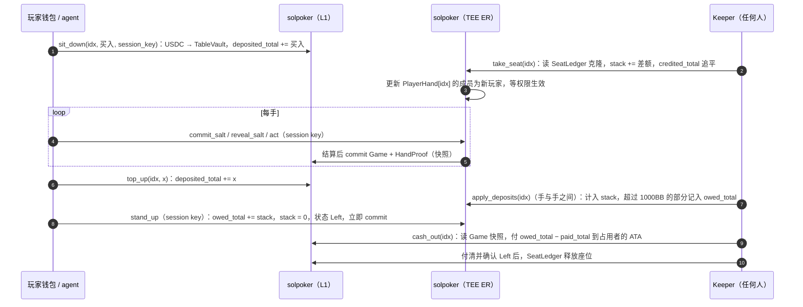
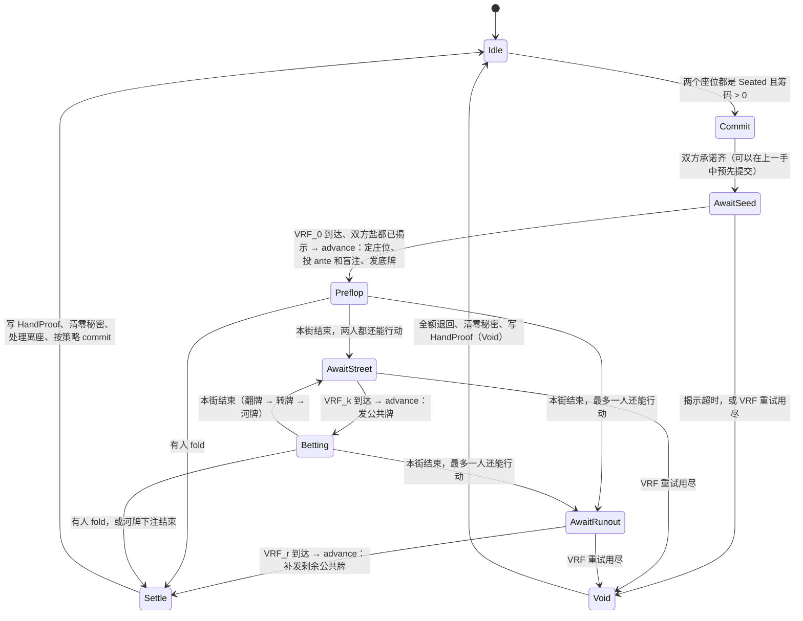

# solpoker Stage 1 设计文档 v1（定稿）

> **状态**：**定稿 v1**。§1 的 D1–D6 和 §18.1 的 E1–E7 已于 2026-09-30 确认；配套文档一审查后新增的 X7–X13 也已同步到本文。
> **依据**：[决策记录](decisions.md)（§8、§9 为最新）、[开发前核实报告](pre-dev-review.md)、[Stage 0 CHANGELOG](../../CHANGELOG.md)、[Stage 1 调研笔记](../stage1-research-notes.md)（本阶段核实的外部事实与出处）。
> **配套文档**：[AI 桌与 x402 架构](stage1-agents-x402.md)、[commit 费用与逃生通道：初步应对方案](stage1-fees-escape.md)。
> 本文已取代决策记录中对应的条目（见决策记录 §11），项目指令已同步更新。

---

## 0. 本阶段范围与验收标准

**任务复述**

1. 写出一份可以直接指导 Stage 2–8 编码的设计，涵盖账户与字段、权限矩阵、资金流与守恒、手牌状态机、规则引擎、发牌协议（设计级，字节级规范在 Stage 4 定稿）、VRF 集成、commit 策略、常驻桌与维护模式、会话密钥、客户端连接、指令清单、日志纪律、信任模型和测试计划。
2. 覆盖路线图 S1 和核实报告 §3.1–3.9 的全部条目，对照见附录 A。
3. 把 AI 桌与 x402 的架构写详细（配套文档一）。
4. 针对 Stage 0 遗留的 commit 费用和逃生通道，给出有证据支撑的初步方案（配套文档二）。
5. 每个未定项都附推荐默认值；需要 MagicBlock 回答的问题单独列出。
6. 本阶段不写程序代码，只新增一个取证脚本 `scripts/probe_dlp.py`。

**验收标准**：三份文档和调研笔记入库并推送，CI 为绿；附录 A 的每一项都有对应章节；§1 的修订得到你的确认后，再更新项目指令并进入 Stage 2。

---

## 1. 本阶段的设计修订（已确认，2026-09-30）

写状态机和资金流时，发现原方案有一个正确性问题，另外有几处可以明显简化。以下六项已全部按推荐采纳。

| # | 修订 | 原决定 | 结论 | 主要理由 |
|---|---|---|---|---|
| **D1** | 座位资金账本放在 **Game** 里，Seat 不再委托 | Seat 在入座时委托、离桌时解除委托；每手 commit Game、Seat×2、HandProof | 采纳 | 修复多账户 commit 不原子带来的对账风险；省掉每位玩家每次入座的委托费用；删去 RakeAccount 流程 |
| **D2** | 会话密钥记在 L1 的 **SeatLedger** 里，不再单独建 Session PDA | 程序内自建 Session PDA（owner、session_pubkey、expires_at ≤ 7 天） | 采纳 | 不需要额外租金，x402 agent 没有 SOL 也能入座；授权范围自动限定在这个座位 |
| **D3** | 常驻账户的委托租金由程序 PDA **DelegPayer** 支付 | 未规定（Stage 0 用部署者支付） | 采纳 | 委托程序的 `RequestUndelegation` 要求「委托租金付款人」签名。由程序 PDA 担任付款人，逃生通道就不再依赖运营方的私钥 |
| **D4** | commit 策略写进 Table 配置（默认每手 commit） | 每手 commit | 采纳 | 现行收费有上限，每手 commit 几乎不花钱；但要为 MagicBlock 调价保留调节手段 |
| **D5** | x402 入座以**原子模式**为主：付款交易本身就是 `sit_down` 指令；`credit_x402_deposit` 延后实现 | 先付款、再由网关调用 `credit_x402_deposit` 入账 | 采纳 | 入账不再需要信任网关，付了款却没抢到座位的情况也不会发生。详见配套文档一 §4 |
| **D6** | 揭示盐的交易**只写入本人的 PlayerHand**，由发牌指令读取 | 揭示交易把盐写进 Deck | 采纳 | 揭示交易的指令数据里有盐。只触及本人私有账户，最有可能让这笔交易只对本人可见。Stage 3 实测验证 |

### 1.1 D1 详解：为什么要把账本放进 Game

**问题**：委托程序是逐个账户执行 `commit_state` 和 `finalize` 的，validator 的提交服务可能把一次多账户提交拆成多笔 L1 交易（大账户还要先写 buffer）。所以「每手 commit Game、Seat×2、HandProof」在 L1 上**不保证原子**。如果 validator 在提交中途宕机，L1 上可能出现一个混合快照：Seat A 已经是第 N 手的结果，Seat B 和 Game 还停在第 N−1 手。之后一旦走逃生回滚，各账户会回到不同手的状态，每桌的托管账就对不上了。拆分行为本身会在 Stage 3 实测，但**设计上不应依赖多账户原子性**。

**推荐方案**：把每个座位的资金账本拆成两半，两边都只用**只增不减的累计值**。

| 半边 | 账户 | 字段 | 谁写 |
|---|---|---|---|
| L1（永不委托） | `SeatLedger` | `deposited_total`（入座与补码累计）、`paid_total`（离桌付款累计） | L1 指令 |
| ER（长期委托） | `Game.seats[i]` | `credited_total`（已计入筹码的累计）、`owed_total`（已释放、待付款的累计）、`stack` | ER 指令 |

跨层同步一律采用「读对方快照、按差额入账」：

- ER 读 L1 `SeatLedger` 的只读克隆，把 `deposited_total − credited_total` 计入筹码；
- L1 读 Game **最后一次提交的快照**，把 `owed_total − paid_total` 付给玩家，把 `rake_total − rake_swept_total` 划给 treasury。

这样做的效果：

1. **快照总是一致**：整张桌的余额都在 Game 一个账户里，每次 commit 都是一个完整的快照。回滚到任何一次 commit，账都是平的。
2. **克隆延迟只影响到账速度，不影响正确性**：计数器只增不减，读到旧快照只会少计或少付，下次再补上，不会重复入账。§2.2 里「ER 能否及时读到 L1 账户」的 spike 就从「决定方案 X 还是 Y」降级为「测量到账延迟」。
3. **更省钱**：玩家入座和离桌都不再委托或解除委托 Seat，每位玩家每次入座省下 0.0003–0.00228 SOL 的委托费用（见配套文档二 §1.3）。
4. **更简单**：rake 不再需要 RakeAccount 的「commit_and_undelegate → sweep → 重新委托」流程，L1 的 `sweep_rake` 直接读 Game 快照即可。逃生通道也只需处理常驻账户。
5. **x402 更好接**：座位账户预先建好，入座时不创建账户，也就不需要付租金，这正是 D5 原子模式的前提。

**代价**：L1 指令要解析一个归委托程序所有的账户（Game）。做法是校验地址等于 `PDA(["game", table], 本程序)`、owner 是委托程序或本程序、discriminator 正确，然后按 Game 的结构反序列化。Stage 0 已经实测过：commit 后约 0.6 秒，L1 上就能读到新状态。

**D1 对已确认条目的影响**：

| 已确认条目 | D1 之后 |
|---|---|
| Seat 会话期间委托给 TEE | Seat 拆成 L1 `SeatLedger`（不委托）和 `Game.seats[i]` |
| 入座：L1 转账并创建 Seat，然后委托 | L1 `sit_down` 转账并登记占用（不创建账户），ER `take_seat` 计入筹码 |
| 补码：TopUpReceipt 与方案 X/Y | 改为 `SeatLedger.deposited_total`，ER `apply_deposits` 读克隆入账；原来的兜底方案 Y 不再需要 |
| 离桌：只对该 Seat 执行 commit_and_undelegate，然后 cash_out | ER `stand_up` 后 commit Game，L1 `cash_out` 读快照付款；仍然 permissionless，收款地址钉死 |
| Rake：move_rake → RakeAccount 解除委托 → sweep → 重新委托 | 删除 RakeAccount；L1 `sweep_rake` 直接读 Game 快照 |
| 每手只 commit Game、Seat、HandProof | 每手只 commit Game 和 HandProof |
| 守恒不变量 | 改写成三条（§5.4），语义不变 |

---

## 2. 总体架构



| 层 | 放什么 | 原因 |
|---|---|---|
| L1 | USDC（TableVault）、牌桌配置、座位账本的 L1 半边、agent 注册、全局配置 | 钱永远不进 rollup；L1 状态随时可审计，也是逃生回滚之后的依据 |
| TEE ER | Game（含座位账本的 ER 半边与当前手牌状态）、HandProof、Deck、PlayerHand | 低延迟对局；秘密只存在于 TEE 内的私有账户中 |
| 运营方服务 | 网关与 facilitator、keeper、索引器 | 都不持有能动用户资金的权限。keeper 调用的全是 permissionless 指令；D5 之后网关也不需要特权 |

**设计原则**

1. USDC 永远在 L1，ER 里移动的只是数字。
2. 跨层只传只增不减的累计值，按差额入账（D1）。
3. 秘密（盐、未公开的 VRF 输出、剩余牌堆、底牌）只存在于 ER 的私有账户中，**绝不 commit**。手牌结束时先清零，再公开证明。
4. 任何运营方服务宕机，都只影响速度，不影响资金安全：`cash_out` 和 `sweep_rake` 任何人都能触发，收款地址由程序钉死。
5. 所有可调参数（超时、rake、commit 频率）写在链上的 Table 账户里，不写死在代码中。

---

## 3. 账户模型

### 3.1 总表

租金按 devnet 与主网当前的实测参数计算：`(字节数 + 128) × 5,080` lamports（`getMinimumBalanceForRentExemption(0)` 在两条链上都是 650,240）。大小为估计值，Stage 5–6 定稿。

| 账户 | 种子 | 层 | 委托 | 可见性 | 估计大小 | 租金（SOL） | 谁付 | 生命周期 |
|---|---|---|---|---|---|---|---|---|
| `ProgramConfig` | `["config"]` | L1 | 否 | 公开 | ~200 B | 0.0017 | admin | 永久 |
| `DelegPayer`（D3） | `["deleg_payer"]` | L1 | 否 | 公开 | 0 B（系统账户） | 资金池 | 运营方充值 | 永久 |
| `Table` | `["table", table_id]` | L1 | 否 | 公开 | ~220 B | 0.0018 | admin | 永久（常驻桌） |
| `vault_auth` | `["vault_auth", table]` | — | — | — | 不建账户，只用于签名 | — | — | — |
| `TableVault` | `ATA(vault_auth, mint)` | L1 | **永不** | 公开 | 165 B | 0.0015 | admin | 永久 |
| `SeatLedger` ×2 | `["seat", table, idx]` | L1 | 否 | 公开 | ~176 B | 0.0015 ×2 | admin | 永久，随占用者复用 |
| `AgentProfile` | `["agent", agent_pubkey]` | L1 | 否 | 公开 | ~180 B | 0.0016 | 主人 | 直到注销 |
| `Game` | `["game", table]` | ER | 常驻 | 公开 | ~1.4 KB | 0.0078 | admin | 永久 |
| `HandProof` | `["proof", table]` | ER | 常驻 | 公开 | ~5.4 KB | 0.0283 | admin | 永久，16 手环形缓冲 |
| `Deck` | `["deck", table, epoch]` | ER | 常驻 | **私有**，members = [] | ~320 B | 0.0023 | admin | 每手清零；逃生后换新 epoch |
| `PlayerHand` ×2 | `["hand", table, epoch, idx]` | ER | 常驻 | **私有**，members = [占用者] | ~120 B | 0.0013 ×2 | admin | 每手清零，换人时改成员；逃生后换新 epoch |
| 权限账户 ×3 | 权限程序 `ACLseo…` 的 PDA | ER | — | — | ~160 B（估） | 0.0015 ×3 | admin | 随被保护账户 |
| `DepositRecord`（仅 D5 的标准模式） | `["x402", sig[0..32], sig[32..64]]` | L1 | 否 | 公开 | ~120 B | 0.0013 | 网关 | 永久 |

**每张桌合计**：账户租金约 0.052 SOL，加上 5 个委托账户的委托记录与元数据押金 0.0114 SOL（解除委托时退回，扣除费用），共约 **0.063 SOL**。真人桌 9 张加 AI 桌与混合桌 6 张，共 15 张，约 **0.95 SOL**。HandProof 占每张桌租金的一半以上。

### 3.2 字段定义（字段集已定，大小与顺序在 Stage 5–6 定稿）

下面是 Rust 风格的伪代码，只列设计上关心的字段。所有金额都是 u64 的 USDC 基础单位，所有时间都是 `Clock::unix_timestamp`（秒）。

```rust
// ---------- L1 ----------
pub struct ProgramConfig {
    pub admin: Pubkey,            // 主网为多签
    pub treasury: Pubkey,         // rake 只能付到 ATA(treasury, mint)
    pub tee_validator: Pubkey,    // MTEW…；委托时显式传入，禁止 None
    pub gateway: Pubkey,          // 仅 D5 标准模式使用；原子模式不需要
    pub flags: u32,               // PAUSED | ESCAPE_SUPPORTED | …
    pub version: u16,
    pub bump: u8, pub deleg_payer_bump: u8,
}

pub struct Table {
    pub table_id: u32,
    pub kind: TableKind,          // Human | AgentOnly | Mixed
    pub status: TableStatus,      // Active | Maintenance | Escaping | Escaped
    pub mint: Pubkey,             // tUSDC / Circle USDC；拒绝带转账手续费或 transfer hook 扩展的 mint
    pub sb: u64, pub bb: u64, pub ante: u64,        // 都是 10_000（0.01 USDC）的整数倍
    pub min_buy_in_bb: u16, pub max_buy_in_bb: u16, // 100 / 1000
    pub rake_bps: u16, pub rake_cap_bb: u16, pub rake_min_pot_bb: u16, // 250 / 3 / 1
    pub action_timeout_s: u16,    // 30
    pub commit_timeout_s: u16,    // 10
    pub reveal_timeout_s: u16,    // 10
    pub vrf_timeout_s: u16, pub vrf_max_attempts: u8, // 10 / 3
    pub max_strikes: u8,          // 3
    pub commit_every_n_hands: u8, // 1（D4）
    pub heartbeat_s: u32,         // 1800：有资金在桌、又没有新 commit 时的心跳间隔
    pub escape_stale_s: u32,      // 7200：快照超过这么久没更新，才允许发起逃生
    pub rake_swept_total: u64,    // 已划到 treasury 的 rake 累计（只增）
    pub bump: u8, pub vault_auth_bump: u8,
}

pub struct SeatLedger {             // L1 半边的座位账本（D1），永不委托
    pub table: Pubkey, pub idx: u8,
    pub occupant: Pubkey,         // Pubkey::default() 表示空座
    pub occupancy_id: u64,        // 每次新入座 +1
    pub kind: SeatKind,           // Human | Agent
    pub agent_owner: Pubkey,      // kind = Agent 时等于 AgentProfile.owner
    pub session_key: Pubkey,      // D2
    pub session_expires_at: i64,  // ≤ 入座时刻 + 7 天
    pub payout: Pubkey,           // X7：cash_out 只付给 ATA(payout, mint)；入座时固定（真人为本人，agent 按 AgentProfile.payout）
    pub deposited_total: u64,     // 入座和补码的累计（跨所有占用者，只增）
    pub paid_total: u64,          // cash_out 的累计（只增）
    pub bump: u8,
}

// ---------- ER（委托给 MTEW…） ----------
pub struct Game {                   // 公开
    pub table: Pubkey,
    pub hand_id: u64,
    pub phase: Phase, pub street: Street,
    pub button: u8,               // 庄位 = SB
    pub seats: [SeatState; 2],
    pub pot: u64,                 // 本手所有投入（含 ante）
    pub current_bet: u64, pub last_full_raise: u64,
    pub to_act: u8, pub action_deadline: i64, pub phase_deadline: i64,
    pub action_seq: u32,          // X8：本手内每个改变局面的事件 +1，每手开始归零；act 必须带上
    pub board: [u8; 5], pub board_len: u8, pub board_src: [u8; 5], // 每张公共牌来自哪个 VRF
    pub vrf: VrfSlot,             // { target: Street|Runout, attempt, requested_at, pending }
    pub transcript: [u8; 32],     // 事件流链式哈希
    pub events: EventLog,         // 本手的规范编码事件（上限约 128 条，公开）
    pub last_pair: [u64; 2],      // 上一手双方的 occupancy_id，用来判断是不是新组合的第一手
    pub rake_total: u64,          // 累计 rake（只增）
    pub last_commit_at: i64, pub hands_since_commit: u8,
    pub maintenance_requested: bool,
}

pub struct SeatState {              // ER 半边的座位账本（D1）
    pub occupant: Pubkey, pub occupancy_id: u64, pub kind: SeatKind,
    pub status: SeatStatus,       // Empty | Seated | Left
    pub stack: u64,
    pub credited_total: u64,      // 已计入筹码的入座与补码累计（只增）
    pub owed_total: u64,          // 已释放、等待 L1 付款的累计（只增）
    pub in_hand: u64, pub street_bet: u64,
    pub folded: bool, pub all_in: bool, pub acted: bool,
    pub strikes: u8, pub leave_requested: bool,
    pub salt_commit: [u8; 32], pub next_salt_commit: [u8; 32], // 承诺值公开；盐本身不在这里
}

pub struct Deck {                   // 私有，members = []
    pub hand_id: u64,
    pub vrf_out: [[u8; 32]; 5],   // 翻前、翻牌、转牌、河牌、runout
    pub vrf_attempt_used: [u8; 5],
    pub salts: [[u8; 32]; 2],     // 发牌时从两个 PlayerHand 读入
    pub used_mask: u64,           // 已抽出的牌（52 位）
    pub draw_no: u16,
}

pub struct PlayerHand {             // 私有，members = [占用者钱包]
    pub hand_id: u64,
    pub cards: [u8; 2],           // 0xFF 表示没有牌
    pub salt: [u8; 32],           // D6：揭示交易只写这里
    pub salt_hand_id: u64,
}

pub struct HandProof { pub head: u8, pub entries: [ProofEntry; 16] } // 公开

pub struct ProofEntry {
    pub hand_id: u64, pub status: ProofStatus,  // Settled | Void
    pub button: u8, pub occupancy_ids: [u64; 2],
    pub vrf_out: [[u8; 32]; 5], pub vrf_mask: u8, // 用到了哪几个 VRF
    pub salts: [[u8; 32]; 2],
    pub transcript_final: [u8; 32],
    pub board: [u8; 5], pub hole: [[u8; 2]; 2],
    pub deltas: [i64; 2], pub rake: u64,
    pub settled_at: i64,
}

pub struct AgentProfile {           // L1，主人与 agent 双签注册
    pub agent: Pubkey, pub owner: Pubkey,
    pub payout: PayoutTo,         // X7：Owner（默认）| Agent；只有主人能改，只影响之后的入座
    pub name: [u8; 32], pub meta_uri: [u8; 96],
    pub status: AgentStatus,      // Active | Paused（X9）| Revoked | Banned
    pub registered_at: i64, pub bump: u8,
}
```

**字段纪律**：公开账户（Game、HandProof 在手牌结束前的部分、所有 L1 账户）里绝不出现盐、未公开的 VRF 输出、剩余牌堆或底牌。`Game.events` 只记录「给第几个座位发了一张底牌」，不记录牌面。

---

## 4. 权限矩阵

| 账户 | 层 | `is_private` | members | 谁能读 | 谁能写（程序约束） |
|---|---|---|---|---|---|
| Game | ER | 不建权限账户（公开） | — | 任何人 | 只有 solpoker 程序，按指令规则写 |
| HandProof | ER | 公开 | — | 任何人 | 只有结算指令 |
| Deck | ER | **true** | **[]**（只有 owner，即本程序） | 没有人能通过 RPC 读到 | 发牌、VRF 回调、结算 |
| PlayerHand[i] | ER | **true** | **[当前占用者的钱包]** | 只有占用者本人（凭 token） | 发牌写入底牌；本人的揭示交易写入盐；结算时清零 |
| Table、SeatLedger、TableVault、AgentProfile、ProgramConfig | L1 | —（L1 全部公开） | — | 任何人 | 按指令规则写 |

要点：

- `is_private = false` 时 members 会被忽略，账户完全公开，所以公开账户直接不建权限账户即可。
- Deck 和 PlayerHand 在委托时必须是空的。在 ER 上用 `CreateEphemeralPermissionCpi` 建好私有权限，并确认生效（客户端用 `waitUntilPermissionActive`）后，才允许写入任何秘密。
- 换人时 PlayerHand 的成员替换顺序见 §11.2。
- **读不到数据必须是 PER 权限层强制的结果。** 所有「某人读不到」的结论都要有测试：用对手或旁观者的 token 读，必须被拒绝。

**需要在 Stage 3 实测的交易级可见性**（权限只管账户数据，交易本身的可见性规则还不确定）：

| 交易 | 里面有什么 | 期望 |
|---|---|---|
| `reveal_salt` | 指令数据里有盐 | 只有本人能用 `getTransaction` 读到。D6 让它只触及本人的 PlayerHand，不引用 Game |
| VRF 回调 | 指令数据里有 randomness | 对手读不到最好；读到也不致命，因为种子还需要双方的盐 |
| `advance`（发牌） | 不含秘密（牌在链上计算） | 任何人可读；日志里不得出现牌面 |
| `act`、`claim_timeout` | 公开动作 | 任何人可读 |

---

## 5. 资金流与守恒（D1）

### 5.1 六个累计计数器

| 计数器 | 所在 | 谁增加 | 约束 |
|---|---|---|---|
| `SeatLedger.deposited_total` | L1 | `sit_down`、`top_up` | 只增 |
| `SeatState.credited_total` | ER | `take_seat`、`apply_deposits` | 只增；≤ 读到的 deposited_total |
| `SeatState.owed_total` | ER | `stand_up`（含自动站起）、补码超额退回 | 只增 |
| `SeatLedger.paid_total` | L1 | `cash_out` | 只增；≤ 快照中的 owed_total |
| `Game.rake_total` | ER | 结算 | 只增 |
| `Table.rake_swept_total` | L1 | `sweep_rake` | 只增；≤ 快照中的 rake_total |

规则：每一侧只增加自己的计数器，只读另一侧的快照，转账金额永远等于两边的差额。读到的快照越旧，差额越小，只会晚到账，不会重复入账。

### 5.2 完整流程



**各步的前置条件与效果**

1. **`sit_down`（L1；签名者为占用者钱包或 agent；不创建任何账户）**
   - 牌桌为 Active；`SeatLedger.occupant` 为空；
   - 买入额在 [100BB, 1000BB] 之间，并且是 0.01 USDC 的整数倍；
   - 满足牌桌类型规则和同主人规则（配套文档一 §2）；
   - session 有效期不超过 7 天。
   - 效果：`transfer_checked`（占用者 ATA → TableVault）；设置 `occupant`、`kind`、`session_*`；`occupancy_id += 1`；`deposited_total += 买入`。
2. **`take_seat`（ER；permissionless）**：读 SeatLedger 的克隆。如果克隆中的 `occupancy_id` 大于 `SeatState.occupancy_id`，并且座位是 Empty 或 Left，就令 `stack = deposited − credited`、`credited = deposited`、状态 Seated；然后按 §11.2 替换 PlayerHand 的成员。
3. **`top_up`（L1；只有占用者能签）**：金额大于 0 并且是 0.01 的整数倍，转账后 `deposited_total += x`。L1 不知道当前 stack，所以 1000BB 的上限由 ER 执行。
4. **`apply_deposits`（ER；permissionless；只在手与手之间，或本座位不在手牌中时执行）**：设 `diff = 克隆.deposited − credited`，`room = 1000BB − stack`，则 `credit = min(diff, room)`，`stack += credit`，`credited += diff`，`owed += diff − credit`。超额部分会通过下一次 `cash_out` 退回钱包，即使玩家仍然坐着。
5. **`stand_up`（ER；session key 或钱包签名，也可由系统自动触发）**：手牌进行中调用，等于立即 fold。在手牌边界执行时，先把尚未计入的补码直接记入 `owed`，然后 `owed += stack`、`stack = 0`、状态 Left，同时安排一次 commit，并把 PlayerHand 的成员清空。
6. **`cash_out`（L1；permissionless）**：读 Game 快照（§5.3），付 `快照.owed − paid` 到 `ATA(SeatLedger.occupant, mint)`，然后 `paid += 金额`。当快照中该座位为 Left、`occupancy_id` 与账本一致、`credited == deposited`、并且 `owed == paid` 时，释放座位（`occupant = default`）。如果玩家离座后还有补码到账，ER 的 keeper 会对 Left 状态的座位执行 `apply_deposits`，把它直接记入 owed，下一次 `cash_out` 再付出去。**L1 从不自行退回未计入的补码**，否则下一位占用者入座时会被多计筹码。
7. **`sweep_rake`（L1；permissionless）**：付 `快照.rake_total − rake_swept_total` 到 `ATA(ProgramConfig.treasury, mint)`，然后更新 `rake_swept_total`。

### 5.3 在 L1 上读取 Game 快照

Game 委托期间归委托程序所有，数据就是最后一次 finalize 的提交。L1 指令按以下步骤读取：

1. 地址等于 `PDA(["game", table], 本程序)`；
2. owner 是委托程序 `DELeGG…`（委托中）或本程序（已解除委托）；
3. 前 8 字节是 Game 的 discriminator；
4. 按 Game 的结构反序列化。结构版本号写在 Game 里，维护模式迁移时同步升级。

只要委托程序和 validator 按规则提交，这个地址上的数据就无法伪造。

### 5.4 守恒不变量

| 编号 | 不变量 | 在哪里断言 |
|---|---|---|
| **I-ER** | Σ credited_total = Σ stack + pot + rake_total + Σ owed_total | 每条 ER 资金指令结束时；proptest |
| **I-L1** | TableVault 余额 ≥ Σ deposited_total − Σ paid_total − rake_swept_total；每条 L1 资金指令前后，余额的变化恰好等于本指令转账额 | 每条 L1 资金指令结束时；proptest |
| **I-X**（跨层） | TableVault 余额 = Σ(deposited − credited_快照) + Σ stack_快照 + (rake_total_快照 − rake_swept) + Σ(owed_快照 − paid) + 盈余，盈余 ≥ 0 | `audit_table`（L1，任何人可调用，只读），CI 和 keeper 定期运行 |
| **I-M** | 六个计数器都不会减少 | proptest |
| **I-B** | credited ≤ deposited、paid ≤ owed_快照、rake_swept ≤ rake_total_快照 | 相应指令内 |

commit 只在手与手之间发生（此时 pot = 0），所以 I-X 里没有 pot。唯一的例外是逃生：活着的 validator 响应逃生请求时，可能在手牌中途把 Game 写回 L1，这时 `escape_settle` 先把 pot 按每人的 `in_hand` 退回，再检查 I-X（配套文档二 §2.3）。「盈余」来自有人直接往 TableVault 转账，程序不会动用它（D5 标准模式除外）。

`Table` 里另有一个 `epoch: u16`，是 Deck 和 PlayerHand 种子的一部分，只在逃生后由 admin 加一。

### 5.5 故障情形

| 情形 | 结果 |
|---|---|
| ER 读到的 SeatLedger 克隆是旧的 | 入座或补码晚几秒计入，不会多计 |
| commit 延迟 | 离桌晚到账；L1 仍然按上一份快照保持全额担保 |
| validator 在手牌中宕机 | 最后一份快照在手牌边界，pot = 0，账是平的。恢复后继续；如果长期不恢复，走逃生通道，进行中的那一手作废（配套文档二 §2） |
| 有人直接向 TableVault 转账 | 记为盈余，I-X 仍然成立 |
| USDC 的 freeze authority 冻结了某个 ATA | 对这个玩家的 `cash_out` 会失败，钱仍在 TableVault 里，解冻后可以重试。Circle USDC 有 freeze authority，这是合规层面的已知风险 |
| Token-2022 的转账手续费或 transfer hook | `create_table` 直接拒绝带这些扩展的 mint，保证「转入多少就记多少」 |

---

## 6. 手牌状态机

### 6.1 阶段



`Betting` 泛指翻牌、转牌、河牌三条街的下注轮。

### 6.2 由谁推进

Solana 上没有定时执行，所有推进都靠交易触发：

| 推进方式 | 指令 | 谁发 |
|---|---|---|
| 玩家动作 | `commit_salt`、`reveal_salt`、`act`、`stand_up` | 本人（session key 或钱包） |
| 确定性推进 | `advance`：定庄位、投强制注、发底牌、发公共牌、结算 | 任何人（keeper、双方客户端都会发） |
| 超时 | `claim_timeout`、`retry_vrf` | 任何人，截止时间过后才能成功 |
| 本街结束时请求 VRF | 结束本街的那笔 `act` 交易直接 CPI 请求 VRF_k，省一个往返 | 本人 |

VRF 回调**只存 randomness**，所以回调之后总需要一笔 `advance` 来发牌。D6 规定揭示交易只写本人的 PlayerHand，所以揭示之后发底牌也需要一笔 `advance`。以后可以用 SDK 的 `crank` 模块替代 keeper 自动推进，Stage 3 评估。

### 6.3 计时与超时（默认值写在 Table 里）

| 阶段 | 期限 | 超时后 | 计入超时次数 |
|---|---|---|---|
| Commit | 10 秒 | 本手不开始（还没有任何投入，不需要退款）。未提交的一方记一次，重新计时 | 是 |
| 揭示盐 | VRF_0 到达后 10 秒 | 本手作废。缺盐的一方记一次 | 是 |
| 等待 VRF | 每次 10 秒，最多 3 次，每次都是新请求 | 3 次都失败则本手作废，全额退款 | 否 |
| 行动 | 30 秒 | 能 check 就 check，否则 fold | 是 |
| 手间间隔 | 2 秒 | 给前端播放动画 | — |

- 计时一律用 ER 的 `Clock::unix_timestamp`，不用 slot。
- 等待 VRF 期间不设行动截止时间，下注轮开始时才设，这就是「暂停行动计时器」。
- 超时次数在玩家主动行动后清零；**连续 3 次**就在本手结束时自动站起。
- ante 和盲注在 `advance` 发底牌的同一步投入，所以在「揭示盐」阶段作废时还没有任何投入，不涉及退款。发出底牌之后作废（例如转牌的 VRF 连续失败），所有投入（含 ante）全额退回，不收 rake。

### 6.4 延迟预算

每条街的关键路径是：结束本街的 `act`（一次往返）→ VRF 回调 → `advance`（一次往返）。Stage 0 在 devnet-tee 上测到一次往返约 1.2 秒，其中大部分是沙盒所在网络的开销；VRF 延迟在 Stage 2 实测。**这些数字是上限**：你提到主网上 MagicBlock ER 和 VRF 会快很多。所以所有期限都做成可配置的，Stage 2 用 devnet 的 p50 和 p95 定初始值，主网上线前再从目标地区对 `mainnet-tee` 重新测量并调整。

两项优化：

1. **预提交承诺**：下一手的盐承诺可以在当前这手进行中就提交（存进 `next_salt_commit`），所以正常情况下 Commit 阶段不用等。
2. **揭示与 VRF 并行**：双方承诺都齐后，VRF_0 的请求和盐的揭示同时进行。承诺早已锁定，揭示得早不会带来任何优势。

---

## 7. 规则引擎（heads-up No-Limit Hold'em）

### 7.1 规则

| 项目 | 规则 |
|---|---|
| 位置 | 庄位就是 SB。翻前 SB 先行动，翻后 BB 先行动 |
| 第一手庄位 | 一对新组合（任一座位的 `occupancy_id` 与 `Game.last_pair` 不同）的第一手，庄位由 seed_0 决定（§8.3）；之后每手轮换 |
| 强制投入顺序 | 两人各投 ante（0.1BB）→ SB → BB。短码先投 ante，再尽量投盲注，不够就 all-in |
| ante | 死钱：进底池，不计入当轮下注额，归本手赢家 |
| 金额粒度 | 所有买入、补码、下注都必须是 10,000 基础单位（0.01 USDC）的整数倍。因为 ante、盲注和 stack 都是 0.01 的整数倍，all-in 金额自然也是 |
| 下注 | 翻后最小下注 1BB；无限注，上限就是本人剩余 stack |
| 加注 | 加注增量 ≥ 本轮上一次**完整**加注的增量。翻前初始增量为 1BB，所以翻前最小加注到 2BB |
| 不足额 all-in | 增量小于完整加注的 all-in 不会重新开放行动：已经行动过的一方只能跟注或弃牌 |
| 未跟注部分 | 在结算和计算 rake 之前先退回 |
| 自动发完公共牌 | 本街下注结清后，最多只剩一人还能行动（另一人已 all-in），就进入 AwaitRunout（§8.6） |
| 摊牌 | 7 张里选最好的 5 张；平局平分，奇数筹码（0.01）给非庄位（BB） |
| 弃牌 | 能 check 时也允许 fold；超时时能 check 就 check |
| 手牌中站起或断线 | 视为立即 fold |
| stack 为 0 | 本手结束后自动站起（owed 增加 0，座位随后释放） |

### 7.2 Rake 与结算（伪代码）

```text
settle():
  return_uncalled_bet()                     # 先退回未跟注的部分
  pot = seats[0].in_hand + seats[1].in_hand # 含 ante
  rake = 0
  if flop_dealt and pot > rake_min_pot_bb * bb:      # 翻前 all-in 后自动发完公共牌也算“发出了翻牌”
      r = pot * rake_bps / 10_000                     # 250 bps = 2.5%
      r = (r / 10_000) * 10_000                       # 向下取整到 0.01 USDC
      rake = min(r, rake_cap_bb * bb)                 # 上限 3BB
  distributable = pot - rake
  if single winner w:  stack[w] += distributable
  else:                                   # 平分
      half = (distributable / 2 / 10_000) * 10_000
      stack[button]     += half
      stack[1 - button] += distributable - half        # 多出的 0.01 给 BB
  rake_total += rake
  assert I-ER
```

作废的手牌：每人的 `in_hand` 全额退回 stack，不收 rake，HandProof 记为 Void。

### 7.3 测试性质（Stage 5 的 proptest）

- **守恒**：任意动作序列下，每一步之后 I-ER 都成立。
- **计数器单调**：credited、owed、rake_total 从不减少。
- **合法性**：非法动作（不轮到你、金额不是 0.01 的倍数、小于最小加注、超过 stack）一律被拒绝，且状态不变。
- **终止**：每手在有限步内进入 Settle 或 Void。
- **确定性**：相同的种子和动作序列，结果逐字节相同。
- **rake 的边界**：rake ≤ 3BB；rake ≤ pot 的 2.5%；rake 是 0.01 的整数倍；没发翻牌时 rake = 0；pot ≤ 1BB 时 rake = 0。
- **奇数筹码**：平分时 BB 拿到的比庄位多 0 或 0.01。

### 7.4 计算预算

7 选 5 的牌型评估（21 种组合 × 2 名玩家）用不查大表的整数编码实现，目标是结算指令整体低于 200k CU（单笔交易上限为 1.4M）。Stage 5 实测，超标就把结算拆成「评估」和「分配」两条指令。发牌不做整副洗牌，每抽一张做一次 HMAC 加上可能的重抽，每张牌的开销是常数级。

---

## 8. 发牌协议（设计级，字节级规范在 Stage 4 定稿）

以 CHIPCHIP CSRP v1 的写法为蓝本，改造成「VRF + 双方盐」的可证明公平方案。Stage 4 交付 `docs/dealing-protocol.{zh,en}.md`、`reference/solpoker_deal.py` 和 `vectors/v1/*.json`，由 CI 校验链上 Rust 实现、Python 参考实现和测试向量三者逐字节一致。

### 8.1 符号

- `table`：Table 账户地址（32 字节）；`hand_id`：u64；`player_i`：座位 i 的占用者钱包（32 字节，即使动作由 session key 签名，这里也用钱包地址）。
- 所有整数一律**大端**编码，与「取前 8 字节按大端读」保持一致。
- `‖` 表示字节拼接；字符串常量按 UTF-8 编码，不带结尾的 0。

### 8.2 盐承诺与揭示

```text
salt_i  = 32 字节，每手用 CSPRNG 重新生成（客户端或 agent SDK）
C_i     = sha256("solpoker/salt/v1" ‖ table ‖ hand_id ‖ player_i ‖ salt_i)
```

1. `commit_salt(hand_id, C_i)`：公开写进 `Game.seats[i]`（可以提前提交下一手的）。
2. 双方承诺都齐后请求 VRF_0，同时开放揭示。
3. `reveal_salt(hand_id, salt_i)`：D6 规定这笔交易**只写本人的 PlayerHand**，不引用 Game。
4. `advance` 发牌时，从两个 PlayerHand 读出盐，校验 `sha256(...) == C_i`。校验不通过，本手作废，这一方记一次超时。
5. **绝不在只有一方掌握种子时发牌**：VRF_0 到达并且双方的盐都通过校验，才发底牌。

### 8.3 逐街种子与第一手庄位

```text
seed_k = sha256(VRF_k ‖ salt_0 ‖ salt_1)        k ∈ {翻前 0, 翻牌 1, 转牌 2, 河牌 3, runout r}
button = HMAC-SHA256(seed_0, "solpoker-v1/button" ‖ table ‖ hand_id)[0] & 1   # 只在新组合的第一手使用
```

盐的顺序按座位编号（0、1），不按 SB/BB。盐每手只提交一次，各街复用。

### 8.4 抽牌

```text
msg   = "solpoker-v1" ‖ table ‖ hand_id ‖ draw_no(u16) ‖ retry(u16) ‖ transcript_digest(32)
v     = BE_u64( HMAC-SHA256(key = seed_k, msg)[0..8] )
n     = 当前牌堆剩余张数
if v < (2^64 mod n):  retry += 1，重算          # 拒绝采样，消除取模偏差
index = v mod n；从有序牌堆中取出第 index 张并删除
```

- 牌堆是按牌编号升序排列的有序列表。牌编号为 `rank × 4 + suit`：rank 从 2 到 A 对应 0–12，suit 按 ♣♦♥♠ 对应 0–3（Stage 4 定稿）。
- `draw_no` 在一手内连续编号：底牌 0–3（从 SB 开始，每人一张，共两轮：SB、BB、SB、BB），翻牌 4–6，转牌 7，河牌 8。
- **每张牌都绑定最新的事件流**：每抽一张就追加一条事件（底牌只记座位和 draw_no，不记牌面），所以下一张牌用到的 `transcript_digest` 已经包含了上一张。

### 8.5 事件流与规范编码（设计级，字节级规范在 Stage 4 定稿）

```text
transcript_0     = sha256("solpoker/transcript/v1" ‖ program_id ‖ table ‖ hand_id)
transcript_{n+1} = sha256(transcript_n ‖ encode(event_n))
encode(event)    = tag(u8) ‖ 固定宽度字段（大端）
```

| tag | 事件 | 字段 |
|---|---|---|
| 0x01 | HandStart | hand_id、button、stack[2]、occupancy_id[2] |
| 0x02 | SaltCommitted | seat、C_i |
| 0x03 | VrfFulfilled | 目标（街或 runout）、attempt（不含随机数本身，它在手牌结束后公开） |
| 0x04 | ForcedBet | seat、类型（ante、SB、BB）、金额 |
| 0x05 | HoleDealt | seat、draw_no（**不含牌面**） |
| 0x06 | StreetStart | street |
| 0x07 | Action | seat、类型（fold、check、call、bet、raise、all-in）、加注到的金额 |
| 0x08 | Timeout | seat、自动动作 |
| 0x09 | BoardDealt | street、牌、draw_no、VRF 来源 |
| 0x0A | RunoutStarted | — |
| 0x0B | StreetSkipped | street |
| 0x0C | HandEnd | 结果类型、deltas[2]、rake |
| 0x0D | HandVoid | 原因 |

`Game.events` 保存本手的完整事件列表（公开）。每手结算时 Game 会被 commit，所以每一手的完整事件都会留在 L1 的提交交易历史里，不只是最近 16 手；索引器同时保存一份。

### 8.6 all-in 合并

本街下注结清、最多只剩一人还能行动时，追加 `RunoutStarted` 事件，只请求一次 VRF_r，用 `seed_r` 按顺序抽出剩余的公共牌；draw_no 接续编号，每张牌照样先追加 `BoardDealt` 事件再抽下一张。HandProof 的 `board_src` 记录每张公共牌用的是哪一个 VRF。前端照样逐街翻出。

### 8.7 手牌结束后公开什么、怎么验证

结算或作废时写入 `ProofEntry`：本手用到的所有 VRF 输出（含 runout）及实际采用的 attempt、两份盐、最终 transcript、公共牌、双方底牌、结果与 rake。**随后在同一笔交易里清零 Deck 和两个 PlayerHand**，再 commit Game 和 HandProof。

任何人都可以这样验证一手牌：

1. 从 HandProof（或 L1 提交历史、索引器）取出这一手的证明条目和事件列表；
2. 用 `C_i` 的公式校验两份盐；
3. 按事件列表重算 transcript，与 `transcript_final` 比对；
4. 按 §8.3–8.4 重新抽出每一张牌，与公开的底牌和公共牌比对；
5. 按 §7 的规则重算结果与 rake，与 deltas 和 rake 比对；
6. 在 VRF 程序的链上记录里，确认每个 VRF 输出确实是对应请求的回调结果（Stage 2 确定具体做法）。

`reference/solpoker_deal.py` 会提供这个验证器，前端的「验证这一手」按钮也调用同一套逻辑。

### 8.8 秘密的存放位置

| 数据 | 牌局进行中 | 手牌结束后 |
|---|---|---|
| salt_i | 本人客户端；揭示后在本人的 PlayerHand 和 Deck 里 | 写入 HandProof，然后清零 |
| VRF_k | Deck（私有） | 写入 HandProof，然后清零 |
| seed_k | 不落盘，每次计算时推导 | 可以由公开数据重算 |
| 剩余牌堆（used_mask） | Deck | 清零 |
| 底牌 | 本人的 PlayerHand | 写入 HandProof，然后清零 |
| 公共牌 | 发出后写进 Game（公开） | 公开 |

Deck 和 PlayerHand 在含有秘密期间绝不 commit。它们委托时的 `commit_frequency_ms` 保持 `u32::MAX`（不自动 commit），并且只在维护模式、确认已清零之后才会随解除委托写回 L1。

---

## 9. VRF 集成

| 项目 | 设计 |
|---|---|
| 请求方式 | 在 TEE ER 内用 `create_request_randomness_ix`（scoped identity）加 `invoke_signed_vrf` 发起请求 |
| 队列 | devnet 和主网都用 ER 队列 `5hBR571x…`，本地用 `Sc9MJUng…`。已核实这个 ER 队列在 devnet 和主网上都委托给了「任意 validator」（委托记录中的 validator 为全 1 地址），所以 TEE ER 可以直接使用；主网的队列地址与 SDK 常量相同 |
| 请求标识 | `caller_seed = sha256("solpoker/vrf/v1" ‖ table ‖ hand_id ‖ 目标 ‖ attempt)`，保证每次请求都不同。源码已确认回调数据是 `判别符 ‖ randomness ‖ callback_args`，所以把 `(hand_id, 目标, attempt)` 放进 `callback_args`，回调时校验它等于当前挂起的请求；Stage 2 实测 |
| 回调 | 回调账户结构体加 `#[vrf_callback]`，由它校验签名者是 `PDA(["identity", 本程序 ID], VRF 程序)`。回调只把 randomness 写进 Deck，不洗牌、不抽牌。**身份不对才报错；身份正确但请求已过期或不匹配时返回 Ok 并忽略**：回调报错会让整笔 fulfillment 回滚，请求会一直留在队列里，直到 120 秒 TTL |
| 重试 | 10 秒内没有回调，任何人都可以调用 `retry_vrf`，用新的 attempt 重新请求同一条街，最多 3 次；迟到的旧回调直接忽略 |
| 失败 | 3 次都失败，本手作废，全额退款 |
| 延迟 | devnet 的实测数据作为上限；你指出主网会快很多，所以期限和重试参数都写在 Table 里。Stage 2 测 devnet 的 p50 和 p95，上线前再测一次 mainnet-tee |
| 费用 | 源码：L1 队列每次 0.0005 SOL（高优先级 0.0008）；**ER 队列 `5hBR…` 永远免费**。队列暂停时请求报 `QueuePaused`；请求 120 秒后过期 |

---

## 10. commit 策略（摘要，详见配套文档二）

- **commit 什么**：只 commit Game 和 HandProof，一次 commit 用一个 `MagicIntentBundleBuilder` 意图打包；Deck 和 PlayerHand 永远不 commit。
- **什么时候 commit**：只在手与手之间（pot = 0）。具体时机：
  - 每 N 手（`commit_every_n_hands`，默认 1）；
  - 有人站起时立即 commit，好让 `cash_out` 尽快到账；
  - 心跳：有资金在桌、但距上次 commit 超过 `heartbeat_s` 时，由 keeper 触发；
  - 进入维护模式之前。
- **委托参数**：`commit_frequency_ms = u32::MAX`，由程序自己决定何时 commit，不让 validator 定时自动 commit。
- **意图的付款人**：发起这笔 ER 交易的签名者（keeper 或玩家）。付款人没有被委托，所以不需要 `magic_fee_vault`。
- **费用**：按现行委托程序源码，commit 本身不收费；只在解除委托时按次数收费，并且每个账户有约 0.00228 SOL 的封顶。常驻账户几乎从不解除委托，所以每手 commit 的边际成本约等于 0。完整分析见配套文档二 §1。

---

## 11. 常驻桌、换人与维护模式

### 11.1 建桌（部署脚本，每张桌执行一次）

1. L1 `create_table`：创建 Table、TableVault、SeatLedger×2、Game、HandProof、Deck、PlayerHand×2，并校验 mint 不带转账手续费或 transfer hook 扩展。
2. L1 `delegate_table`：把 Game、HandProof、Deck、PlayerHand×2 委托给 `ProgramConfig.tee_validator`（MTEW…，显式传入）。租金付款人是 `DelegPayer`（D3，需要自写委托 CPI，见配套文档二 §2.3）；`commit_frequency_ms = u32::MAX`。
3. ER `init_permissions`：用 `CreateEphemeralPermissionCpi` 创建 Deck（私有，members = []）和 PlayerHand×2（私有，members = []）的权限账户。
4. 等权限生效，牌桌进入 Idle。

`scripts/deploy-tables` 一次创建 9 张真人桌（三档各 3 张）。AI 桌和混合桌每档各 1 张，共 6 张（Q15 已定），Stage 8 用同一个脚本创建。空桌也不关。

### 11.2 换人时的底牌权限

PlayerHand 按座位固定，换人必须严格按下面的顺序进行，保证旧玩家读不到新玩家的底牌：

1. 旧玩家 `stand_up` 时，PlayerHand 已在结算中清零；同时用 `UpdateEphemeralPermissionCpi` 把 members 改成 []，越早收回越好。
2. 新玩家在 L1 `sit_down` 之后，ER `take_seat` 先断言 PlayerHand 已清零（没有牌、盐为零），再把 members 从 [] 改成 [新玩家]，并把这次更新所在的 slot 记进 Game。
3. 新组合的第一手必须等权限生效才能开始：程序要求当前 slot 晚于记录的 slot，客户端在提交承诺前调用 `waitUntilPermissionActive`。权限更新在 ER 内何时生效，列入给 MagicBlock 的问题。
4. **必须有测试覆盖**：用旧玩家的 token 读新玩家的 PlayerHand，必须被拒绝；用新玩家的 token 读，必须成功。

### 11.3 维护模式（仅管理员）

1. ER `enter_maintenance`（admin 签名）：设置 `Game.maintenance_requested`。当前这手照常打完，之后不再开新手。
2. 在手牌边界：秘密账户本来就已经清零，程序再断言一次。
3. 对 5 个常驻账户执行 commit_and_undelegate。Deck 和 PlayerHand 写回 L1 的是全零数据，不会泄露任何信息。
4. 在 L1 上升级程序或迁移账户结构（Game 带版本号）。维护期间 Game 归本程序所有，玩家可以在 L1 上直接站起并 `cash_out`。
5. 重新委托，重建或刷新权限，恢复对局。正常运营中不关桌。

### 11.4 逃生通道

详见配套文档二 §2。要点：

- 代码预留，按运行时条件启用（`probe_dlp.py` 通过后，admin 才设置 `ESCAPE_SUPPORTED` 标志）。
- **只对 Game 和 HandProof 发起逃生**。活着的 validator 会把当前状态写回 L1，所以 Deck 和 PlayerHand 永远不参与；逃生后换一个新的 epoch，重新建这两类账户。
- 只有在快照陈旧（默认超过 2 小时）并且有资金在桌时，任何人才能发起；keeper 每 30 分钟发一次心跳 commit，所以健康的牌桌不会被踢出 ER。
- 在主网的委托程序支持 `RequestUndelegation` 之前，主网不上线（或需要你另行决定兜底方案）。

---

## 12. 会话密钥与签名（D2）

| 项目 | 设计 |
|---|---|
| 存放 | `SeatLedger.session_key` 和 `session_expires_at`（L1，有效期不超过 7 天） |
| 设置 | 在 `sit_down` 时一并传入，或由占用者钱包单独调用 `set_session` |
| 真人授权方式 | 真人的 session key 由 Privy 钱包在 `sit_down` 交易里一次签名授权（Stage 7 钱包层决定，见 §13 末尾）；agent 的入座交易仍由 agent 密钥直接签名 |
| 撤销 | `revoke_session`：**只有占用者本人**可以撤销（session-keys 3.1.1 允许任何人撤销，对手可以借此逼你超时，这里不存在这个问题）；座位释放时自动清空 |
| 可签的指令 | `commit_salt`、`reveal_salt`、`act`、`stand_up`（都是 ER 指令） |
| 不可签的指令 | 所有 L1 资金指令：`sit_down`、`top_up`、`set_session` 等 |
| 兜底 | 所有 ER 动作指令都接受占用者钱包直接签名 |
| 读底牌 | session key 不能读 PlayerHand。读权限绑定的是钱包公钥（agent 就是 agent 公钥），需要钱包 `signMessage` 一次换取 token |
| 撤销的时效 | ER 读的是 SeatLedger 的克隆，撤销在克隆刷新之后生效（秒级）。session key 只能签对局动作，碰不到资金，这个延迟可以接受 |
| 手续费付款人 | session key 自己付 ER 交易的手续费。按用户的说法 ER 不接受余额为 0 的付款人，所以 session key 预充 0.001 SOL（X10）：真人和原生路径 agent 在 `sit_down` 交易里自己转；x402 agent 由网关另转，每 7 天最多一次；离桌或到期时自己把余额转回。**实测**：今天 devnet-tee（ER 0.16.0）和本地栈（ER 0.14.10）都接受零余额付款人，ER 内交易费为 0（调研笔记）。金额和阈值是前端与网关的配置，不写进程序 |

每条 ER 动作指令都以只读方式带上本座位的 SeatLedger，用来校验签名者是占用者本人，或者是未过期的 session key。

---

## 13. 客户端连接与 attestation

1. **端点**：对局交易和读取全部走 `devnet-tee.magicblock.app?token=…`（主网为 `mainnet-tee.magicblock.app`，validator 身份同为 MTEW…）。Magic Router 只用于 L1 操作。
2. **钱包层**：Stage 7 前端用 Privy（`@privy-io/react-auth`）连接钱包：登录后得到内嵌 Solana 钱包，也可以连接用户自己的外部 Solana 钱包；无论哪种，前端把用户最终使用的钱包当作占用者钱包。详见本节末尾「钱包层：Privy」。
3. **入场检查**（每次打开页面做一次，结果缓存）：
   - 包一层自己的 `verifyTeeRpcIntegrity`，challenge 用 `crypto.getRandomValues` 生成（SDK 自带的实现用的是 `Math.random()`）；
   - `getAuthToken`：由 Privy 钱包对 challenge `signMessage` 一次（每个会话一次），token 只放在内存里，并提供「重新鉴权」入口；
   - 在 MagicBlock 公布 TDX 度量值之前，门控只能做到「对面确实是 TDX 机器」这一层，信任页要如实说明。
4. **发送交易**：直接 `sendRawTransaction`，然后轮询或订阅确认。不用 Anchor `.rpc()` 的默认确认方式：Stage 0 实测它要 1.8–9.3 秒，直接发送只要约 2 个往返。L1 资金交易（`sit_down`、`top_up`）由前端组装后交给 Privy 钱包作为完整交易签名；ER 对局动作由 session key 签名，手牌中不弹钱包。
5. **订阅状态**：先订阅 Game（公开）和本人的 PlayerHand（凭 token），再发送交易，避免 Stage 0 遇到的订阅竞态。
6. **延迟**：沙盒测到的 600 ms 往返不代表真实玩家的网络；主网也会更快。上线前从目标地区实测。

### 钱包层：Privy（Stage 7 决定，2026-10-06）

1. **钱包层 = Privy**（`@privy-io/react-auth`）：登录后产生一个内嵌 Solana 钱包，也可以连接外部 Solana 钱包；前端以用户最终使用的钱包作为「占用者钱包」。
2. **`signMessage`**：由 Privy 的 Solana 钱包对 `getAuthToken` 的 challenge 签名，每个会话一次；challenge 必须用 `crypto.getRandomValues` 生成（不用 `Math.random`）；TEE token 只放在内存里。
3. **L1 资金操作**（`sit_down`、`top_up`）：由 Privy 钱包作为完整交易签名。
4. **会话密钥**（§12，D2）：每个座位在本地新生成一对 ed25519 密钥；`sit_down` 交易携带 `session_key` 和 `session_expires_at`，由 Privy 钱包签一次；对局动作（`commit_salt`、`reveal_salt`、`act`、`stand_up`）一律由 session key 签名，手牌中不弹钱包；X10 给 session key 预充的 0.001 SOL 放在同一笔 `sit_down` 交易里。
5. **前端技术栈**：Next.js App Router + React 19；Solana Purple 主题（#9945FF / #14F195，按 A11）不变。

---

## 14. 指令清单

「权限」一栏：P 表示 permissionless（任何人），O 表示占用者（钱包或 session key），W 表示占用者钱包，A 表示 admin。

### 14.1 L1 指令

| 指令 | 权限 | 作用 | 守恒断言 |
|---|---|---|---|
| `init_config` / `update_config` | A | 设置 admin、treasury、tee_validator、gateway、flags | — |
| `create_table` | A | 创建一张桌的全部账户（§11.1） | 金库余额为 0 |
| `delegate_table` | A | 由 DelegPayer 付租金，委托 5 个常驻账户给 MTEW… | — |
| `register_agent` | agent + 主人双签 | 创建 AgentProfile；主网要求主人在 `OwnerAllowlist` 内 | — |
| `update_agent` / `set_payout` / `revoke_agent` | 主人 | 修改资料、修改 payout（只影响之后的入座）或永久注销 | — |
| `pause_agent` / `resume_agent` | 主人 | Active ↔ Paused（X9） | — |
| `set_agent_status` | A | 封禁或解封（合规需要） | — |
| `sit_down` | W（agent 本人） | 转账进金库，登记占用，设置 session，固定 payout（X7）；不创建账户 | I-L1 |
| `top_up` | W | 转账进金库，`deposited_total += x` | I-L1 |
| `set_session` / `revoke_session` | W | 设置或撤销 session key | — |
| `cash_out` | P | 读 Game 快照，付款给 `ATA(SeatLedger.payout, mint)`，条件满足时释放座位 | I-L1、I-B |
| `sweep_rake` | P | 读 Game 快照，把 rake 划到 treasury | I-L1、I-B |
| `audit_table` | P（只读） | 检查 I-X，失败时报错 | I-X |
| `request_escape` | P（需满足条件）/ A | 逃生第一步，只针对 Game 和 HandProof（配套文档二 §2） | — |
| `escape_rollback` | P（等待期满后） | 逃生第二步：超时回滚，指令内先保存再恢复账户数据 | — |
| `escape_settle` | P | 回滚之后在 L1 上结算 Game：作废进行中的手牌，未计入的补码、stack 和 in_hand 都记入 owed | I-X |
| `undelegate_all` / `redelegate` / `migrate` | A | 维护模式（§11.3） | I-X |
| `credit_x402_deposit` / `refund_x402_deposit` | 网关（仅 D5 标准模式） | 延后实现，见配套文档一 §4.3 | I-L1 |

### 14.2 ER 指令

| 指令 | 权限 | 作用 | 守恒断言 |
|---|---|---|---|
| `init_permissions` | A | 创建 Deck 和 PlayerHand 的私有权限 | — |
| `take_seat` | P | 读 SeatLedger 克隆，计入买入，替换 PlayerHand 成员 | I-ER |
| `apply_deposits` | P | 在手与手之间计入补码，超额部分记入 owed | I-ER |
| `commit_salt` | O | 提交本手或下一手的盐承诺 | — |
| `reveal_salt` | O | 只写本人 PlayerHand（D6） | — |
| `advance` | P | 确定性推进：定庄位、投强制注、发牌、结算、作废。开新手前复查两个座位的资格（X12）：真人座位上的钱包不能有 AgentProfile，agent 座位上的 AgentProfile 必须是 Active，不满足的一方站起 | I-ER |
| `vrf_callback` | VRF 身份 | 只存 randomness | — |
| `retry_vrf` | P（超时后） | 重新请求当前这条街的 VRF | — |
| `act` | O | 参数带 `hand_id` 和 `action_seq`，对不上以 `StaleAction` 拒绝（X8）；fold、check、call、bet、raise、all-in；结束本街时直接请求下一个 VRF | I-ER |
| `claim_timeout` | P（超时后） | 能 check 就 check，否则 fold；记超时次数 | I-ER |
| `stand_up` | O | 站起；手牌进行中视为 fold；立即安排 commit | I-ER |
| `heartbeat` | P | 满足条件时安排一次 commit | — |
| `enter_maintenance` | A | 本手结束后停止开新手 | — |

---

## 15. 日志、事件与错误码纪律

1. 任何种子、盐、randomness、牌面都**不得**出现在 `msg!`、Anchor 事件或错误信息中。公共牌发出后可以作为公开事件出现。
2. 每个程序只有一个 `#[error_code]`，错误信息只写原因类别，例如「承诺不匹配」，不带任何数据。
3. **泄露检测测试**（Stage 3 起加入 CI）：在本地栈上跑完整的若干手牌，收集所有交易日志、事件和错误，用这几手的盐、VRF 输出和底牌的十六进制与 base58 形式逐一搜索，出现任何一个就判失败。
4. 关心的公开事件：HandStarted、ActionTaken、BoardDealt、HandSettled、HandVoided、SeatTaken、SeatLeft、CashedOut、RakeSwept。

---

## 16. 信任模型（信任页的底稿）

| 性质 | 由什么保证 | 用户怎么验证 | 仍然需要信任的部分 |
|---|---|---|---|
| 钱只能付给本人 | 程序钉死了收款地址（入座时固定的 payout 的 ATA：真人为本人，agent 默认为主人）；`cash_out` 任何人都能触发 | 读开源代码、核对可验证构建、看 L1 上的余额 | 程序升级权限（主网交给多签或锁定升级） |
| 每张桌全额有担保 | I-X 不变量；commit 只在 pot = 0 时发生 | 任何人都可以调用 `audit_table` | 同上 |
| 牌局中底牌保密 | TEE 加 PER 权限层 | attestation（目前只能证明是真的 TDX 机器） | MagicBlock 的 TEE 实现；度量值尚未公布 |
| 发牌无法被操纵 | VRF 加双方各自的盐 | 按 HandProof 复算每一张牌 | VRF 诚实，或者至少有一名玩家诚实地生成了盐 |
| 结算正确 | 程序逻辑 | 按事件流复算 | TEE 执行正确 |
| 随时可以离桌 | `cash_out` permissionless；逃生通道 | 看 L1 快照 | 委托程序升级之前：依赖 validator 存活 |
| 运营方看不到底牌 | PER 权限层；运营方服务不持有玩家的 token | 权限账户的内容是公开的 | 托管式 MCP 例外（仅 devnet，见配套文档一） |
| 历史可审计 | 每手 commit Game，完整事件留在 L1 提交历史里 | 用验证器复算 | RPC 节点对历史交易的保留期 |

pokerable 在其信任页上称 MagicBlock 只保留约一周的执行记录，这需要 MagicBlock 书面确认后才能写进我们的信任页。

---

## 17. 测试计划与各 Stage 的对应

| Stage | 相关章节 | 必须通过的测试或测量 |
|---|---|---|
| S2 VRF | §9 | TEE 内请求并回调成功；回调身份校验；延迟 p50/p95；超时重试；迟到的旧回调被忽略；回调能否带回请求标识 |
| S3 隐私与基础设施 spike | §4、§5、§11、配套文档二 | 克隆刷新延迟；多账户 commit 的拆分方式（验证 D1 的前提）；权限更新何时生效；交易级可见性（揭示交易、VRF 回调）；换人后旧玩家读不到；ER 能否接受 L1 上余额为 0 的手续费付款人；DelegPayer 自写委托 CPI；用 v3.1.0 源码自建委托程序，在本地测逃生通道；日志泄露检测 |
| S4 发牌协议 | §8 | 三方逐字节一致的 CI；测试向量覆盖重抽、runout、作废 |
| S5 规则引擎 | §6、§7 | §7.3 的全部 proptest；结算 CU < 200k |
| S6 托管与常驻桌 | §5、§10、§11、§14 | sit_down → cash_out 全流程；I-L1、I-ER、I-X 的 proptest；sweep_rake；维护模式；15 张桌的部署脚本；逃生指令能编译，并能按探测结果启用 |
| S7 前端 | §12、§13、§16 | attestation 门控；先订阅再发送；信任页逐项链接证据 |
| S8 agent 与 x402 | 配套文档一 | 原子入座；agent 对局；同主人拦截；MCP 的支出上限 |

---

## 18. 决策状态与外部问题

### 18.1 已确认（2026-09-30）

| # | 问题 | 结论 |
|---|---|---|
| D1–D6 | §1 的六项修订 | 全部采纳 |
| E1 | §6.3 的超时默认值：承诺 10 秒、揭示 10 秒、VRF 10 秒 × 3 次、行动 30 秒、手间 2 秒 | 采纳，Stage 2 按实测调整 |
| E2 | 心跳 30 分钟；快照超过 2 小时未更新才允许任何人发起逃生 | 采纳（理由见配套文档二 §2.3） |
| E3 | 手牌进行中站起视为立即 fold | 采纳 |
| E4 | 拒绝带转账手续费或 transfer hook 扩展的 mint | 采纳 |
| E5 | 混合桌的入座规则：按已定的 Q14，混合桌是一人对一个 agent。推荐固定座位：0 号座只接受真人，1 号座只接受已注册的 agent | 采纳（见配套文档一 §2.2） |
| E6 | 在 `package.json` 中声明 `"type": "module"`（Stage 0 遗留问题 6） | Stage 2 顺手处理 |
| E7 | 主网上线的硬性前提：主网委托程序支持逃生通道 | 采纳；如果 MagicBlock 迟迟不升级，再讨论兜底方案（配套文档二 §2.5） |

### 18.2 需要 MagicBlock 回答（更新版）

1. 委托程序 v3.1.0（`RequestUndelegation` 和超时回滚）在 devnet 和主网的部署计划。附上我们的探测证据：两条链都返回 `InvalidInstructionData`。
2. 一次 commit 多个账户时，L1 上是否原子？validator 会不会把它们拆成多笔交易？
3. 主网 ER 与 TEE ER 的交易费和 commit 收费是否会调整？commit 有没有频率限制？
4. 主网 ER 是否接受 L1 上余额为 0 的手续费付款人，是否收 ER 交易费、从哪里扣？（devnet-tee 和本地栈今天实测都接受，交易费为 0；我们暂按「不接受」设计，给 session key 预充 0.001 SOL）
5. ER 对 L1 只读克隆的刷新机制和延迟上限。
6. `UpdateEphemeralPermission` 在 ER 内何时生效？更新之后，旧成员持有的 token 是否立即失效？
7. 交易级可见性：只触及私有账户的交易，其他人能否用 `getTransaction` 读到指令数据和日志？
8. 是否公布 TDX 度量值（MRTD、RTMR）？执行记录的保留期是多久？
9. 主网 TEE 上 VRF 的费用、延迟和速率限制。
10. 同一个 validator 能否长期（数月）持有委托？validator 轮换或重启时会发生什么？

---

## 附录 A：核实报告 §3 与路线图 S1 的对照

| 条目 | 本文位置 |
|---|---|
| 路线图 S1：托管模型（决策记录 §2） | §1.1、§5 |
| 路线图 S1：发牌协议规范（决策记录 §4） | §8 |
| 路线图 S1：常驻桌与维护模式（决策记录 §2.6） | §11 |
| 路线图 S1：ante 与 rake 规格（决策记录 §8.1） | §7 |
| 3.1 账户生命周期 | §3、§11 |
| 3.2 洗牌协议 | §8 |
| 3.3 揭示交易与 VRF 回调的可见性 | §4、D6、§17 S3 |
| 3.4 公开完整牌序会暴露弃牌 | 已按 A8 决定公开，§8.7 |
| 3.5 超时由谁触发 | §6.2、§6.3 |
| 3.6 session key 的两个坑 | §12（D2） |
| 3.7 attestation 的保证有限 | §13、§16 |
| 3.8 Stage 7 的连接方式 | §13 |
| 3.9 计算预算 | §7.4 |
| Stage 0 遗留 10：commit 按意图还是按账户计费 | 配套文档二 §1（已从源码核实：只在解除委托时按账户收费） |
| Stage 0 遗留 12：逃生通道 | 配套文档二 §2（已取证：devnet 和主网都不支持） |
| Stage 0 遗留 6：`"type": "module"` | §18.1 E6 |

## 附录 B：确认后需要同步到项目指令的改动

1. 「资金托管」一节：Seat 改为 SeatLedger（L1）加 Game.seats（ER）；删除 TopUpReceipt、方案 X/Y、RakeAccount；守恒不变量改写成 §5.4 的三条。
2. 「提交规则」一节：每手结算后只 commit Game 和 HandProof；commit 频率可配置。
3. 「Session key」一节：改为 SeatLedger 中的字段（D2）。
4. 「常驻桌长期委托」一节：常驻账户改为 Game、HandProof、Deck、PlayerHand×2，委托租金由 DelegPayer 支付（D3）。
5. 「Agent 与 AI 桌」一节：入座以原子模式为主（D5）。
6. 「发牌协议」第 2 步：揭示交易只写本人的 PlayerHand（D6）。
7. 「关键地址」一节：补充主网的 VRF 队列（与 devnet 相同）和 `mainnet-tee.magicblock.app`。
