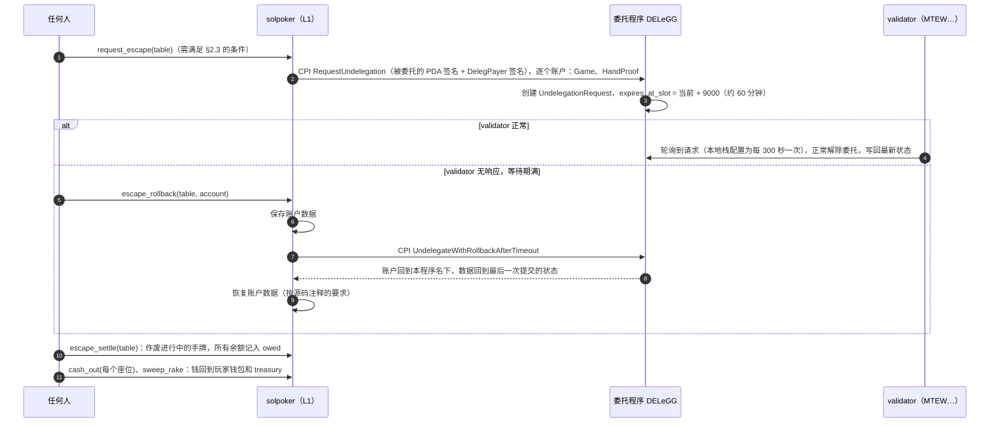

# commit 费用与逃生通道：初步应对方案（Stage 1 配套文档二）

> **状态**：初步方案。日期：2026-09-30。
> **依据**：委托程序源码（`magicblock-labs/delegation-program`，tag v3.1.0，与 HEAD `fb6668c` 中的相关代码一致）、Stage 0 的 devnet 实测、本阶段用 `scripts/probe_dlp.py` 在 devnet 和主网上的探测结果。出处和原始数据见[调研笔记](../stage1-research-notes.md)。
> 相关设计：[主设计文档](stage1-design.md) 的 D1（账本放进 Game）、D3（DelegPayer）、D4（commit 策略可配置）。

---

## 0. 结论摘要

**commit 费用**

1. 按现行源码，**commit 本身不向我们收费**。费用只在解除委托时按账户结算：`0.0003 + 0.0001 × (commit 次数 − 1)` SOL，并且**封顶**为该账户委托记录与元数据的租金，对我们的种子约为 0.00228 SOL，第 21 次 commit 就达到封顶。L1 上提交交易的手续费由 validator 支付（Stage 0 实测每笔 24,200–33,800 lamports）。
2. 采用 D1 之后，玩家入座和离座都不再委托，常驻账户又几乎从不解除委托，所以**每手、每位玩家的边际成本都约等于 0**。每张桌每次维护周期约 0.0055 SOL，15 张桌约 0.082 SOL。
3. 真正的风险是 MagicBlock **调整收费或限制 commit 频率**，所以保留三个调节手段：每 N 手 commit 一次、合并 HandProof 进 Game、心跳间隔。

**逃生通道**

4. v3.1.0 源码中有 `RequestUndelegation` 和 `UndelegateWithRollbackAfterTimeout`，但**devnet 和主网上部署的委托程序都不认识这两条指令**（探测证据见 §2.2），本地栈自带的委托程序与 devnet 的逐字节相同，同样不支持。
5. 方案：代码预留，按运行时条件启用；委托租金改由程序 PDA 支付（D3），这样逃生不依赖运营方的私钥；**只对 Game 和 HandProof 发起逃生**（它们承载资金状态），Deck 和 PlayerHand 永不参与，避免活着的 validator 把牌局中的秘密写回 L1；本地用 v3.1.0 源码自建委托程序做端到端测试。
6. **主网上线的硬性前提**：主网委托程序支持逃生通道，并且我们的端到端测试在 devnet 上通过。

---

## 1. commit 费用

### 1.1 源码事实

| 事实 | 位置 |
|---|---|
| `COMMIT_FEE_LAMPORTS = 100_000`，`SESSION_FEE_LAMPORTS = 300_000`，`PROTOCOL_FEES_PERCENTAGE = 10` | `dlp-api/src/consts.rs` |
| 费用只在解除委托时收取，逐个账户计算：`commit_count = last_commit_id − 1`，`fee = 100_000 × commit_count + 300_000` | `src/processor/fast/undelegate.rs::process_delegation_cleanup` |
| 封顶：`fee = min(fee, 委托记录租金 + 元数据租金)`，从这两个 PDA 关闭时的租金里扣，其余退给委托租金付款人 | 同上 |
| 所扣费用 10% 进协议金库，90% 进 validator 金库 | 同上 |
| `commit_state`、`commit_finalize`、`finalize` 不收费 | 对应处理函数 |
| 超时回滚路径（逃生）用普通的 `close_pda` 关闭账户，**不收费**，租金全额退回 | `undelegate_with_rollback_after_timeout.rs` |
| 付款人本身被委托时，ER 侧会扣回调费（`magic_fee_vault`） | magic program api 0.10.1；SDK `MagicIntentBundleBuilder::magic_fee_vault()` |

### 1.2 与 Stage 0 实测对账

| 项目 | 实测（lamports） | 按源码推算 |
|---|---|---|
| `delegate` 扣款 | 2,331,640 | 委托记录与元数据的租金 2,326,640，加交易费 5,000 |
| 解除委托退款 | 1,926,640 | 2,326,640 − 费用 400,000 |
| 费用 | 400,000 | 0.0003 + 0.0001 × (2 − 1)：本周期共 commit 2 次（含解除委托时的那一次） |
| L1 提交交易的手续费 | 24,200 / 33,800 | 由 validator `MTEW…` 支付，不向我们收取 |

### 1.3 成本模型

我们的 PDA 种子是 `[标签, table]`，委托记录与元数据的租金合计 2,280,920 lamports（0.00228 SOL），这就是每个账户每个委托周期的费用上限。

| 场景 | 原方案（Seat 每次入座都委托） | D1 之后 |
|---|---|---|
| 每位玩家每次入座 | 打 1 手 0.0004 SOL；打 10 手 0.0013 SOL；打 20 手以上 0.00228 SOL（封顶）。另加委托和解除委托的交易费 | **0** |
| 每手 | 0（commit 不收费） | 0 |
| 每张桌每次维护周期 | Game、HandProof 封顶，加上 RakeAccount 每天一次的委托周期 | Game 和 HandProof 各 0.00228，Deck 和 PlayerHand×2 各 0.0003（只在解除委托时 commit 一次）：**约 0.0055 SOL** |
| 15 张桌每次维护周期 | — | **约 0.082 SOL** |
| 委托押金（解除委托时退回，扣除上面的费用） | — | 每张桌 5 个账户共 0.0114 SOL |

举例：如果每天有 1,000 人次入座，原方案每天要多花最多 2.28 SOL，D1 之后是 0。

### 1.4 风险与调节手段

| 风险 | 影响 | 调节手段 |
|---|---|---|
| R1：MagicBlock 改为每次 commit 都收费 | 假如每个账户每次 commit 收 0.0001 SOL，每手 commit 2 个账户就是 0.0002 SOL（SOL 按 150 美元计约合 0.03 美元）。在 0.1/0.2 档，这可能超过一手的平均 rake | ① `commit_every_n_hands` 调到 N > 1（代价：逃生回滚时，最多丢失最近 N 手的结果，钱仍然守恒）；② 把 HandProof 合并进 Game，每手只 commit 1 个账户；③ 站起时照常立即 commit，保证离桌不变慢 |
| R2：commit 频率限制 | 15 张桌满员时，大约每小时 1,000–1,500 次 commit | 同上；询问 MagicBlock 的上限 |
| R3：主网 ER 对交易收费 | 玩家的每个动作都要付费 | 我们不委托付款人，不涉及回调费；如有需要，由 keeper 代付或给 session key 充一点 SOL |
| R4：L1 拥堵导致 commit 变慢 | 只是离桌到账变慢；L1 始终按上一份快照保持全额担保 | 监控每张桌的 `now − last_commit_at` |

### 1.5 Stage 3 的实测计划

1. 一次 commit Game 和 HandProof 时，L1 上会产生几笔交易？每个账户是否单独 finalize？（这也是 D1 的前提。）
2. commit 延迟的分布：devnet 上 p50 和 p95；主网上线前再测一次。
3. 大量 commit 之后解除委托，费用是否确实封顶在 0.00228 SOL。
4. ER 内交易是否收费，以及 L1 上余额为 0 的付款人能否在 ER 内发交易。
5. DelegPayer 的自写委托 CPI 能否跑通（§2.3）。

### 1.6 监控

- `DelegPayer` 的余额低于阈值时告警（它要为委托押金和逃生请求的租金垫款）。
- 每张桌的 commit 滞后（`now − last_commit_at`）：有资金在桌时超过 `heartbeat_s` 就告警。
- keeper 的 SOL 余额告警。

---

## 2. 逃生通道

### 2.1 机制（委托程序 v3.1.0）



两条指令的账户要求（摘自源码）：

- **RequestUndelegation（判别符 26）**：委托租金付款人（签名，**必须等于元数据中记录的 rent_payer**）、被委托账户（签名，由 owner 程序 CPI 时用 PDA 种子签）、owner 程序、请求 PDA `["undelegation-request", 被委托账户]`、委托记录、元数据、system program。请求已存在时重复调用不报错。
- **UndelegateWithRollbackAfterTimeout（判别符 27）**：被委托账户（签名）、owner 程序、请求 PDA、委托记录、元数据、委托租金付款人、commit state 与 commit record PDA、commit 费用退款账户。返回最后一次提交到 L1 的状态，源码注释写明「可能丢失数据」，并要求包装层在调用前保存、调用后恢复账户数据。

### 2.2 部署现状（取证）

`scripts/probe_dlp.py` 用 `simulateTransaction`（不校验签名）向目标链的委托程序发送判别符 26 和 27，与已知指令（判别符 3）和不存在的指令（判别符 250）对比：

| 链 | 判别符 26 / 27 | 判别符 3（已知指令） | 结论 |
|---|---|---|---|
| devnet | `InvalidInstructionData`（与不存在的指令相同） | `NotEnoughAccountKeys`（说明认识这条指令，只是账户不够） | **不支持** |
| 主网 | 同上 | 同上 | **不支持** |
| 本地栈 | 自带的委托程序与 devnet 的逐字节相同（459,416 B） | — | **不支持** |

委托程序最后一次部署：主网 2026-04-29（slot 416,508,270），devnet 2026-04-27（slot 458,511,904）。

### 2.3 设计

**(a) 委托租金付款人改为程序 PDA（D3）**

`RequestUndelegation` 要求委托租金付款人签名。如果付款人是运营方的私钥，逃生就要靠运营方配合，失去了意义。所以常驻账户的委托一律由 `DelegPayer`（种子 `["deleg_payer"]`，system 所有、只存 lamports）支付，程序可以用种子替它签名。

SDK 0.17.3 的 `delegate_account` 只替被委托的 PDA 签名（`sdk/src/cpi.rs`），所以要用 `magicblock-delegation-program-api` 3.1.0 的 instruction builder 自己写委托 CPI，同时传入两组种子。Stage 3 做 spike。**兜底**：如果自写 CPI 跑不通，改由 admin 热钱包支付委托租金，`request_escape` 也改为需要 admin 签名，并在信任页如实说明。

**(b) 只对 Game 和 HandProof 发起逃生**

validator 如果还活着，看到请求后会**正常解除委托，把当前的 ER 状态写回 L1**。如果对 Deck 或 PlayerHand 发起请求，而当时恰好有一手牌在进行，盐和底牌就会被写到 L1 上公开。所以：

- Deck 和 PlayerHand 永远不参与逃生。它们不承载任何资金状态，留在原 validator 上也不影响退款。
- Deck 和 PlayerHand 的种子加入 `epoch`（`["deck", table, epoch]`、`["hand", table, epoch, idx]`）。逃生之后 admin 用新的 epoch 建一套新账户，旧账户永远不去动它。主设计文档 §3.1 的种子据此更新。
- Game 被正常解除委托时，可能处在一手牌的中途（pot ≠ 0）。Game 是公开账户，写回 L1 不泄露秘密；`escape_settle` 会把这手作废，把每个座位的 `in_hand` 退回。

**(c) 谁可以发起**

| 条件 | 说明 |
|---|---|
| `ProgramConfig.flags` 中设置了 `ESCAPE_SUPPORTED` | admin 在目标链上运行 `probe_dlp.py` 通过后设置；没有设置时直接返回明确的错误，而不是委托程序晦涩的报错 |
| 快照显示有资金在桌 | Σ stack + Σ in_hand + Σ(owed − paid) + Σ(deposited − credited) > 0 |
| 快照已经陈旧 | L1 上的 `now − Game.last_commit_at > escape_stale_s`（默认 2 小时） |
| admin | 任何时候都可以发起（用于维护模式失败时兜底） |

**(d) 心跳，防止有人把健康的牌桌踢出 ER**

只要有资金在桌，keeper 就每 `heartbeat_s`（默认 30 分钟）触发一次 `heartbeat` commit。所以健康的牌桌的快照最多 30 分钟就会刷新，永远达不到 2 小时的陈旧门槛。没有资金在桌的空桌不允许发起逃生，因为没有必要。逃生请求 PDA 的租金由 DelegPayer 垫付，回滚关闭时全额退回。

**(e) `escape_settle`（L1，permissionless）**

回滚之后 Game 归本程序所有，程序直接在 L1 上改写它：

```text
for seat in seats:
    seat.owed_total   += seat.stack + seat.in_hand + (ledger.deposited_total - seat.credited_total)
    seat.credited_total = ledger.deposited_total
    seat.stack = 0; seat.in_hand = 0; seat.status = Left
pot = 0
table.status = Escaped
assert I-X
```

之后按正常流程 `cash_out`（每个座位）和 `sweep_rake`，钱全部出清。进行中的那一手不写入 HandProof，视为作废。

**(f) 最坏情况下的时间线**

快照陈旧 2 小时 → 请求后等待 9,000 slot（约 60 分钟）→ 回滚、结算、cash_out 约 1 分钟，**合计约 3 小时**。正常离桌只需要约 15 秒。

### 2.4 测试计划

1. **自建委托程序**：从 v3.1.0 tag 构建，加一个仅用于测试的编译开关，把超时从 9,000 slot 改成约 20 slot；本地启动时替换掉自带的 `DELeGG….so`。需要先确认 ER 0.14.10 能否与 v3.1.0 配合工作。
2. **测试用例**：
   - validator 正常时发起请求：约 300 秒内被正常解除委托；
   - 杀掉 ER 进程，等待期满 → `escape_rollback` → 数据保存与恢复正确 → `escape_settle` → 全部 `cash_out`，I-X 成立；
   - 条件不满足时（快照不陈旧、没有设置标志、没有资金在桌）请求被拒绝；
   - Deck 和 PlayerHand 从未收到逃生请求；
   - 快照处在手牌中途（pot ≠ 0）时，作废和退款正确。
3. **devnet**：MagicBlock 升级之后，重新运行 `probe_dlp.py`，然后在 devnet 上跑第一个用例。

### 2.5 主网的上线门槛与兜底

**门槛**：主网委托程序通过 `probe_dlp.py` 的探测，并且 §2.4 的用例在 devnet 上通过。

如果 MagicBlock 在目标上线日期之前没有升级，有以下几种选择，需要你决定：

| 方案 | 做法 | 代价 |
|---|---|---|
| A. 推迟上线 | 等升级 | 时间 |
| B. 限额试运营 | 降低每桌资金上限和每人最大买入额，设立保障金，信任页明确写出「目前资金能否取出依赖 MagicBlock validator 存活」 | 用户体验和合规表述 |
| C. 只上 AI 桌 | 先开放 agent 对局，真人桌晚一些 | 产品节奏 |

推荐 A；如果商业上必须按期上线，选 B，并把限额设得足够低。

### 2.6 需要 MagicBlock 回答

1. v3.1.0 在 devnet 和主网的部署时间表（附上我们的探测结果）。
2. validator 轮询解除委托请求的间隔，devnet 和主网分别是多少？
3. 自写委托 CPI 用程序 PDA 作为委托租金付款人，有没有已知的限制？
4. 超时回滚之后，同一个账户能否重新委托给同一个或另一个 validator？

---

## 3. 行动项

| 行动项 | Stage | 验收 |
|---|---|---|
| 多账户 commit 的拆分方式与延迟实测 | S3 | 报告写入 CHANGELOG |
| DelegPayer 的自写委托 CPI | S3 | 本地和 devnet 都能委托给 MTEW…，委托记录中的 rent_payer = DelegPayer |
| 自建 v3.1.0 委托程序，在本地测逃生通道 | S3 | §2.4 的用例在本地通过 |
| `request_escape`、`escape_rollback`、`escape_settle` 编码 | S6 | 能编译；本地用例通过；按标志位启用 |
| `commit_every_n_hands`、`heartbeat` 编码 | S5–S6 | 参数写在 Table 里；proptest 覆盖 |
| 监控与告警 | S6 | DelegPayer、keeper 余额和 commit 滞后告警 |
| 向 MagicBlock 提问（主设计文档 §18.2 与本文 §2.6） | 现在 | 等你确认后由你转交，或者授权我去对方的 Discord 或 GitHub 提问 |
